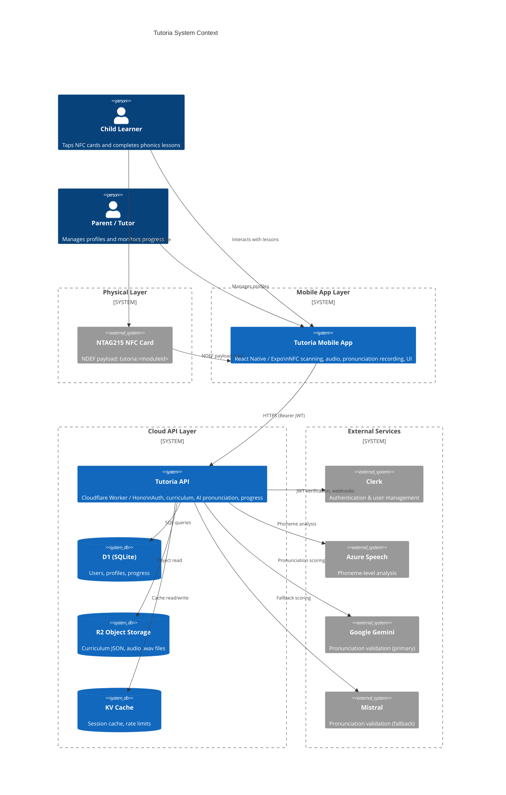
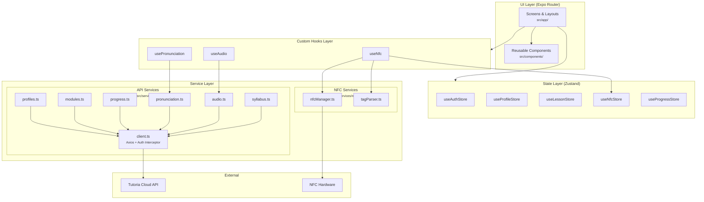
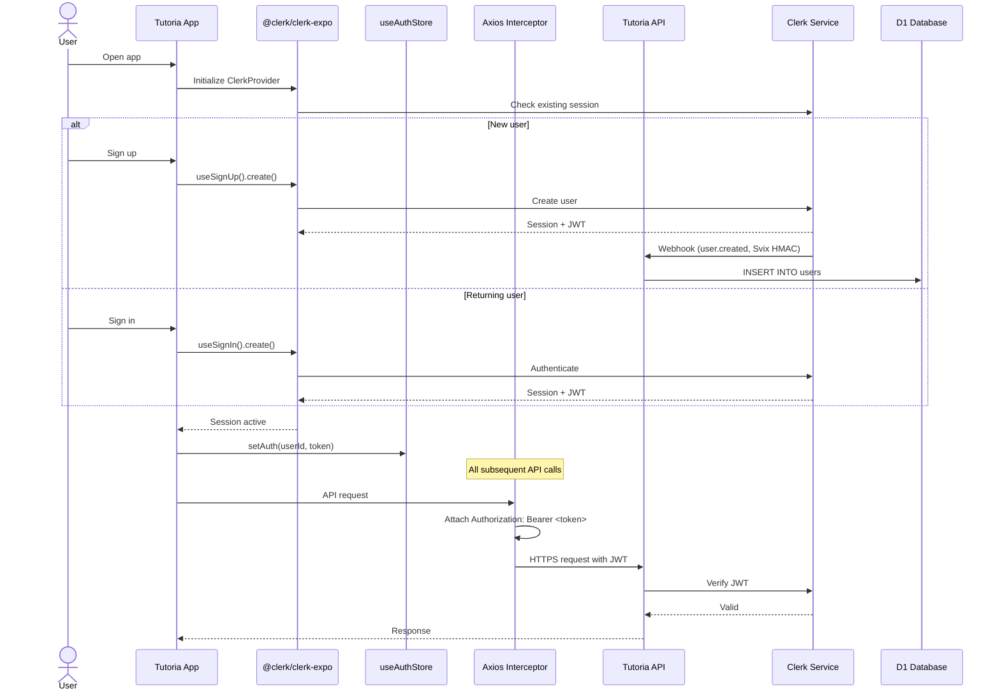
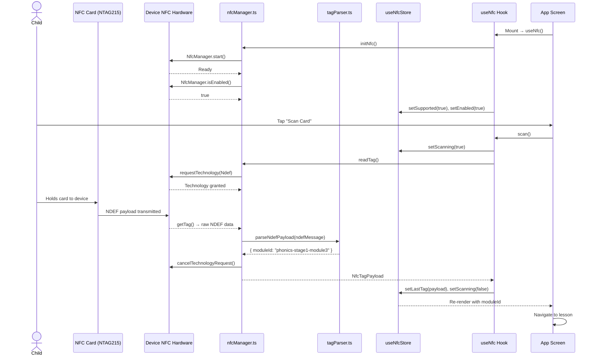
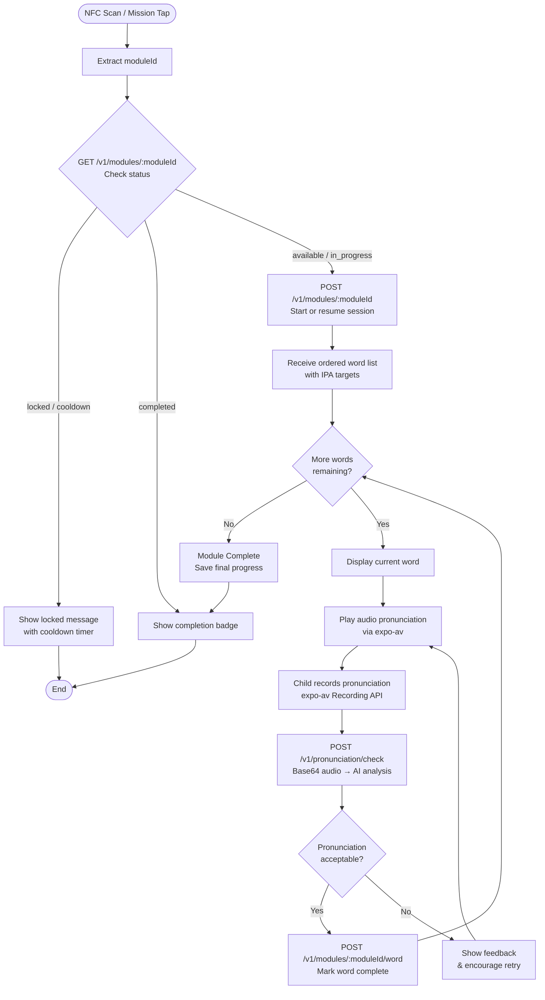
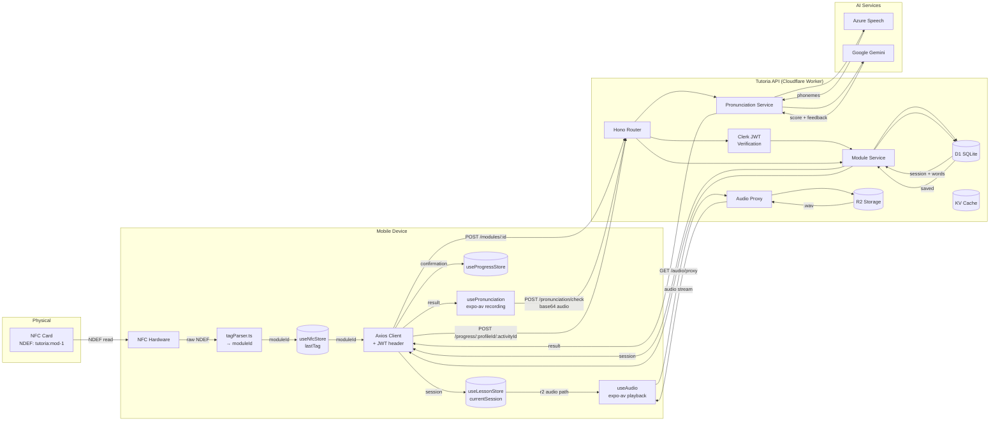

# Tutoria — System & Mobile App Architecture

> Architecture reference for the Tutoria mobile app — a React Native (Expo) application that uses physical NFC cards to deliver phonics lessons to children with dyslexia.

---

## 1. System Overview

Tutoria follows a **"phygital"** model: **physical** NFC cards combined with a **digital** mobile experience. A child taps a physical NTAG215 card on their device, and the app launches the corresponding phonics lesson — bridging tactile interaction with structured digital learning.

### Three-Tier Architecture

| Layer | Technology | Responsibility |
|-------|-----------|----------------|
| **Physical Layer** | NTAG215 NFC cards | Store NDEF payloads (`tutoria:<moduleId>`) that identify curriculum modules |
| **Mobile App** | React Native / Expo (TypeScript) | NFC scanning, audio playback, pronunciation recording, UI, local state |
| **Cloud API** | Cloudflare Worker / Hono | Authentication, curriculum delivery, pronunciation AI, progress persistence |



---

## 2. Backend Architecture

The Tutoria API is a **Cloudflare Worker** built with the [Hono](https://hono.dev) framework. The mobile app communicates with it exclusively over HTTPS — it never accesses backend storage directly.

### Storage

| Service | Purpose | Examples |
|---------|---------|----------|
| **D1 (SQLite)** | Relational data | `users`, `profiles`, `activities`, `progress`, `module_progress`, `pronunciation_metrics` |
| **R2** | Static assets | Curriculum JSON (`/branch/stages/...`), audio files (IPA-keyed `.wav`) |
| **KV** | Caching & ephemeral data | Curriculum stage cache (1 h TTL), rate-limit counters |

### External Services

| Service | Role |
|---------|------|
| **Clerk** | JWT-based authentication; webhooks sync user records to D1 |
| **Azure Speech** | Phoneme-level pronunciation analysis of recorded audio |
| **Google Gemini** | Primary AI model for pronunciation validation / scoring |
| **Mistral** | Fallback AI model when Gemini is unavailable |

### Key API Endpoints

| Method | Endpoint | Description |
|--------|----------|-------------|
| `GET` | `/health` | Health check (no auth) |
| `GET` | `/v1/profiles/list` | List user profiles |
| `POST` | `/v1/profiles/create` | Create a new learner profile |
| `POST` | `/v1/profiles/select` | Validate profile ownership |
| `GET` | `/v1/syllabus/stages` | Curriculum stages (cached 1 h) |
| `GET` | `/v1/modules/missions` | 3 prioritized mission cards |
| `GET / POST` | `/v1/modules/:moduleId` | Get status / start or resume module |
| `POST` | `/v1/modules/:moduleId/word` | Mark a word complete in a session |
| `DELETE` | `/v1/modules/:moduleId` | Abandon module (no attempt increment) |
| `POST` | `/v1/modules/status/batch` | Batch fetch module statuses |
| `GET / POST` | `/v1/progress/:profileId[/:activityId]` | Get progress / save pronunciation attempt |
| `POST` | `/v1/pronunciation/check` | Validate pronunciation (5 req/60 s, 20 s timeout) |
| `GET` | `/v1/audio/proxy?path=<r2-path>` | Proxy R2 audio with 1 h cache |
| `GET` | `/v1/audio/sounds-resolve?ipa=<ipa>` | Resolve IPA string to audio file path |
| `POST` | `/v1/webhooks/clerk` | Clerk webhook receiver (Svix HMAC) |

> **Important:** The mobile app does **not** directly access D1, R2, or KV. All data flows through the API's REST endpoints.

---

## 3. Mobile App Architecture

### Technology Stack

- **Framework:** React Native + Expo 55 (managed workflow)
- **Language:** TypeScript
- **Navigation:** Expo Router (file-based routing under `src/app/`)
- **State management:** Zustand 5
- **HTTP client:** Axios
- **Auth:** @clerk/clerk-expo
- **NFC:** react-native-nfc-manager
- **Audio:** expo-av (playback & recording)

### Project Structure

```
src/
├── app/                    # Expo Router screens & layouts
│   └── _layout.tsx         # Root layout (Slot)
├── components/             # Reusable UI components
├── hooks/                  # Custom React hooks
│   ├── useAudio.ts         # Audio playback via R2 proxy
│   ├── useNfc.ts           # NFC scanning lifecycle
│   └── usePronunciation.ts # Record + check pronunciation
├── services/
│   ├── api/                # Axios client modules per API domain
│   │   ├── client.ts       # Axios instance + Bearer interceptor
│   │   ├── audio.ts        # Audio proxy URL, IPA resolution
│   │   ├── modules.ts      # Missions, sessions, word completion
│   │   ├── profiles.ts     # Profile CRUD
│   │   ├── progress.ts     # Activity progress & streaks
│   │   ├── pronunciation.ts# Pronunciation check
│   │   ├── syllabus.ts     # Curriculum stages
│   │   └── index.ts        # Barrel export
│   └── nfc/                # NFC hardware abstraction
│       ├── nfcManager.ts   # init / readTag / cleanup
│       ├── tagParser.ts    # Parse NDEF → { moduleId }
│       └── index.ts        # Barrel export
├── stores/                 # Zustand state stores
│   ├── useAuthStore.ts     # isSignedIn, userId, token
│   ├── useProfileStore.ts  # profiles[], activeProfile
│   ├── useLessonStore.ts   # currentSession, currentWord
│   ├── useNfcStore.ts      # isScanning, lastTag, isSupported
│   └── useProgressStore.ts # activities[], streakDays
└── utils/
    ├── types.ts            # Shared TypeScript interfaces
    └── constants.ts        # API URLs, NFC prefix, rate limits
```

### Component Diagram



---

## 4. Authentication Flow

Authentication is handled by **Clerk** via the `@clerk/clerk-expo` SDK.

### Key Concepts

- **Clerk** manages signup, login, session tokens, and user lifecycle.
- The `@clerk/clerk-expo` package provides React hooks (`useAuth`, `useUser`, `useSignIn`, `useSignUp`) for session management.
- A **Clerk JWT** is attached to every API request through an **Axios request interceptor** in `src/services/api/client.ts`.
- `useAuthStore` (Zustand) mirrors the Clerk session state (`isSignedIn`, `userId`, `token`) for use across the app.
- **Clerk webhooks** keep the backend D1 `users` table in sync — when a user signs up or updates their account in Clerk, a webhook event (verified with Svix HMAC) writes the data to D1.

### Sequence Diagram



---

## 5. NFC Integration Architecture

NFC functionality is provided by **react-native-nfc-manager**, which wraps platform-specific NFC APIs (Android NFC adapter / iOS CoreNFC).

### Scanning Lifecycle

1. **Initialize** — `NfcManager.start()` on app mount
2. **Request technology** — `NfcManager.requestTechnology(NfcTech.Ndef)`
3. **Read tag** — `NfcManager.getTag()` returns raw NDEF messages
4. **Parse payload** — `parseNdefPayload()` extracts the `moduleId` from the `tutoria:<moduleId>` text record
5. **Cancel** — `NfcManager.cancelTechnologyRequest()` releases the NFC session

### Tag Payload Format

Each NTAG215 card carries a single NDEF Text record:

```
tutoria:<moduleId>
```

Example: `tutoria:phonics-stage1-module3` → the app navigates to module `phonics-stage1-module3`.

### Platform Differences

| Capability | Android | iOS |
|-----------|---------|-----|
| Background scanning | ✅ Supported via Intent filters | ❌ Not supported |
| Foreground scanning | ✅ Automatic | ✅ Requires user action (CoreNFC prompt) |
| NFC availability check | `NfcManager.isEnabled()` | `NfcManager.isSupported()` |
| Dev config | `AndroidManifest.xml` permissions | Entitlements + `Info.plist` |

### Sequence Diagram



---

## 6. Lesson & Module Flow

### Lifecycle

1. An NFC scan (or mission card tap) produces a `moduleId`.
2. `POST /v1/modules/:moduleId` starts a new session or resumes an existing one.
3. The session contains an ordered word list, each with pronunciation targets (IPA, audio paths).
4. For each word the child: sees the word → hears the audio → records their pronunciation → receives AI feedback → progress is saved.
5. The module is complete when all words are finished.
6. **Attempt limits:** maximum **3 attempts** per module, with a **12-hour cooldown** between failed attempts.

### Flowchart



---

## 7. Audio Pipeline

### Asset Storage

Audio files are stored in **R2** as IPA-keyed `.wav` files organized by curriculum branch:

```
/branch/
  └── audio/
      ├── æ.wav
      ├── b.wav
      ├── k.wav
      └── ...
```

### Endpoints

| Endpoint | Purpose |
|----------|---------|
| `GET /v1/audio/proxy?path=<r2-path>` | Proxies an R2 audio file to the client with a 1-hour cache header |
| `GET /v1/audio/sounds-resolve?ipa=<ipa>` | Resolves an IPA string (e.g. `kæt`) into individual sound file paths |

### Playback Flow

1. The `useAudio` hook calls `getAudioProxyUrl(r2Path)` to build the proxy URL.
2. `expo-av` `Audio.Sound` loads and plays the URL.
3. The response is cached by the proxy endpoint (1-hour TTL).

### Pronunciation Recording Flow

1. `usePronunciation` hook starts an `expo-av` recording session.
2. On stop, the audio file is read and **base64-encoded**.
3. The encoded audio is sent via `POST /v1/pronunciation/check` with the display text and target IPA.
4. The API forwards the audio to **Azure Speech** for phoneme analysis, then to **Google Gemini** (or **Mistral** fallback) for scoring.
5. The result (score, feedback, per-phoneme breakdown) is returned to the app.

---

## 8. Data Flow

The diagram below traces data from an NFC card scan through to a persisted progress update.



---

## 9. Offline Strategy

Tutoria is designed to degrade gracefully when the device loses connectivity.

| Capability | Online | Offline |
|-----------|--------|---------|
| **NFC scanning** | ✅ | ✅ Tag parsing is entirely local |
| **Curriculum browsing** | Fetched from API | Served from local cache |
| **Audio playback** | Streamed via proxy | Played from local cache (if previously loaded) |
| **Pronunciation check** | Real-time AI scoring | ❌ Requires network (queued for later) |
| **Progress saving** | Immediate sync to D1 | Queued locally, synced when back online |

### Caching Strategy

- **Curriculum data** (stages, modules): cached locally after first fetch. The `/v1/syllabus/stages` endpoint returns data with a 1-hour cache header; the app stores it in memory / AsyncStorage.
- **Audio assets**: cached by the HTTP layer after first playback. Subsequent plays load from cache without hitting the proxy.
- **Progress updates**: when offline, pronunciation attempts and word completions are queued in local storage. A background sync job replays them when connectivity is restored.
- **NFC scanning**: always works offline — `nfcManager.ts` reads NDEF data directly from the hardware, and `tagParser.ts` extracts the `moduleId` without any network call.
