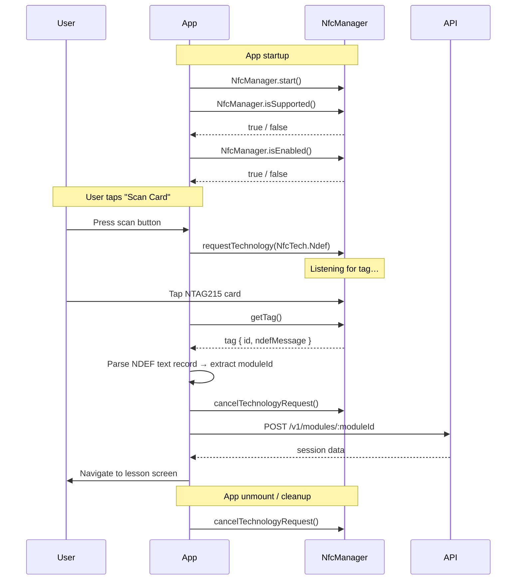

# NFC Integration Guide — Tutoria Mobile App

This guide covers how Tutoria uses NFC (Near Field Communication) to read physical learning cards and trigger phonics lessons. Each card is an NTAG215 tag containing an NDEF text record that maps to a curriculum module.

---

## 1. NTAG215 Card Specification

| Property             | Value                                            |
| -------------------- | ------------------------------------------------ |
| Chip                 | NXP NTAG215                                      |
| User memory          | 504 bytes                                        |
| Total memory         | 540 bytes                                        |
| Standard             | ISO 14443-3A                                     |
| Operating frequency  | 13.56 MHz                                        |
| Read range           | ~2–5 cm                                          |
| Data format          | NDEF (NFC Data Exchange Format) text record       |
| Commercial usage     | Widely used in products such as Nintendo amiibo   |

Each card is NDEF-formatted and stores a short text payload such as `tutoria:module-a` that maps directly to a curriculum module in the Tutoria API.

---

## 2. NDEF Data Format

Cards use an **NDEF text record** with the following conventions:

| Field     | Description                                                        |
| --------- | ------------------------------------------------------------------ |
| Payload   | `tutoria:<moduleId>` — a prefixed string identifying the module    |
| Tag ID    | Unique hardware identifier burned into the chip (used for logging) |

### Payload examples

```
tutoria:module-a
tutoria:stage-1-phonics-b
```

### How the payload is used

The `moduleId` extracted from the payload maps directly to the API endpoint:

```
POST /v1/modules/:moduleId
```

For example, scanning a card with `tutoria:module-a` results in a request to `POST /v1/modules/module-a`.

---

## 3. react-native-nfc-manager Setup

### Installation

The project already has `react-native-nfc-manager` installed. Because this package includes native code, it is **not compatible with Expo Go** — a custom Expo development build (`expo-dev-client`) is required.

### Android Configuration

Add the following to `AndroidManifest.xml` (or configure via Expo plugins in `app.json` / `app.config.ts`):

#### Required permissions

```xml
<uses-permission android:name="android.permission.NFC" />
<uses-feature android:name="android.hardware.nfc" android:required="true" />
```

#### Optional: background tag dispatch intent filter

```xml
<intent-filter>
  <action android:name="android.nfc.action.NDEF_DISCOVERED" />
  <category android:name="android.intent.category.DEFAULT" />
  <data android:mimeType="text/plain" />
</intent-filter>
```

> With the Expo managed workflow, use the `plugins` array in `app.json` or `app.config.ts` alongside `expo-dev-client` to inject native configuration.

### iOS Configuration

1. Enable the **NFC Tag Reading** capability in Xcode.
2. Add the Core NFC entitlement to the app.
3. Set the usage description in `app.json` under `expo.ios.infoPlist`:

```json
{
  "NFCReaderUsageDescription": "Tutoria uses NFC to read learning cards"
}
```

> iOS does **not** support background NFC reading. Scanning must always be initiated by a user action.

---

## 4. NFC Scanning Lifecycle



### Step-by-step

1. **Initialize** — Call `NfcManager.start()` once on app startup.
2. **Check support** — Call `NfcManager.isSupported()` and `NfcManager.isEnabled()` to verify the device has NFC and it is turned on.
3. **Request technology** — Call `NfcManager.requestTechnology(NfcTech.Ndef)` to begin listening for NDEF-compatible tags.
4. **Read tag** — Call `NfcManager.getTag()` to retrieve the tag object, which includes the `ndefMessage` array.
5. **Parse NDEF** — Decode the first text record's payload bytes into a string and extract the `moduleId` after the `tutoria:` prefix.
6. **Cancel** — Call `NfcManager.cancelTechnologyRequest()` in a `finally` block to release the NFC session regardless of success or failure.
7. **Cleanup** — On app unmount, ensure any active technology request is cancelled.

---

## 5. Platform Differences

| Capability                      | Android                          | iOS                                    |
| ------------------------------- | -------------------------------- | -------------------------------------- |
| Background scanning             | ✅ Supported                     | ❌ Not supported                       |
| Foreground scanning             | ✅ Supported                     | ✅ Supported (user-initiated only)     |
| Auto-launch on card tap         | ✅ Via intent filters            | ❌ Not available                       |
| System scanning modal           | ❌ None                          | ✅ Core NFC modal shown automatically  |
| Session timeout                 | None                             | 60 seconds                             |
| Minimum device                  | Android device with NFC hardware | iPhone 7 or later                      |
| Framework                       | Android NFC API                  | Core NFC (NFCNDEFReaderSession)        |
| Multiple NFC tech simultaneously| ✅ Supported                     | ❌ Single session only                 |
| Alert message customization     | N/A                              | ✅ Customizable via `alertMessage`     |

### Android

- Full background NFC scanning is supported via intent filters, allowing the app to launch automatically when a card is tapped.
- Tag discovery works while the app is in both the foreground and background.
- Multiple NFC technologies can be used simultaneously.

### iOS

- Scanning is **foreground only** and must be triggered by a user action (e.g., tapping a button).
- The system displays a modal NFC scanning sheet via Core NFC (`NFCNDEFReaderSession`).
- The session automatically times out after **60 seconds** if no tag is detected.
- Background scanning is not available.
- Requires **iPhone 7 or later**.
- The alert message shown in the scanning modal is customizable.

---

## 6. Tag Validation & Error Handling

### Payload validation

1. **Check prefix** — The payload must start with `tutoria:`.
2. **Validate moduleId** — The portion after the prefix must be a non-empty string.
3. **Reject malformed data** — If the payload is missing, empty, uses the wrong prefix, or contains unexpected characters, treat the scan as invalid.

### Error states

| Error                  | Cause                                           | User feedback                            |
| ---------------------- | ----------------------------------------------- | ---------------------------------------- |
| NFC not supported      | Device has no NFC hardware                      | Show persistent message; disable scan    |
| NFC disabled           | NFC is turned off in device settings            | Prompt user to enable NFC                |
| Scan timeout           | No tag detected within the session window       | Show retry prompt                        |
| Read failure           | Communication interrupted or tag unreadable     | Show error with retry option             |
| No NDEF message        | Tag is blank or not NDEF-formatted              | "Unrecognized card" message              |
| Wrong prefix           | Payload does not start with `tutoria:`          | "This card is not a Tutoria card"        |
| Empty moduleId         | Payload is `tutoria:` with nothing after it     | "Invalid card data"                      |

### User feedback

- **Successful scan** — Trigger haptic feedback via `expo-haptics` (`Haptics.notificationAsync(Haptics.NotificationFeedbackType.Success)`).
- **Failed scan** — Trigger error haptic or vibration pattern and display an inline error message.

---

## 7. Card-to-Lesson Mapping

The NFC card payload determines which lesson to launch. The mapping is straightforward:

```
Card payload: "tutoria:module-a"  →  moduleId: "module-a"
```

### Client flow after a successful scan

1. **Parse tag** — Extract `moduleId` from the NDEF text record.
2. **Check eligibility** — `GET /v1/modules/:moduleId?profileId=<profileId>` — returns whether the profile can attempt the module (`canAttempt`).
3. **If `canAttempt` is true** — `POST /v1/modules/:moduleId` — creates a new session and returns session data.
4. **Navigate** — Open the lesson screen with the session data.
5. **If `canAttempt` is false** — Display a cooldown timer or a "max attempts reached" message depending on the reason.

```
┌──────────┐     Parse      ┌────────────┐   GET /modules/:id   ┌─────────┐
│ NFC Scan │───────────────▶│ Extract ID │─────────────────────▶│  API    │
└──────────┘                └────────────┘                      └────┬────┘
                                                                     │
                                                          canAttempt?│
                                                    ┌────────────────┼────────────────┐
                                                    │ true           │                │ false
                                              ┌─────▼─────┐         │         ┌──────▼──────┐
                                              │POST module │         │         │Show cooldown│
                                              │→ session   │         │         │  message    │
                                              └─────┬──────┘         │         └─────────────┘
                                                    │                │
                                              ┌─────▼──────┐        │
                                              │  Navigate   │        │
                                              │  to lesson  │        │
                                              └─────────────┘        │
```

---

## 8. Testing Without Physical Cards

During development you may not have physical NTAG215 cards. Use these alternatives:

### Emulate with a second phone

1. Install the **NFC Tools** app on a second Android phone.
2. Write an NDEF text record with a payload like `tutoria:module-a`.
3. Tap the emulating phone against the development device.

### Mock NFC in code

Set the environment variable to enable a mock NFC provider:

```
EXPO_PUBLIC_ENABLE_NFC_MOCK=true
```

When enabled, the app bypasses real NFC scanning and returns a simulated tag response, allowing UI and API integration testing without hardware.

### Manual module entry

As a development fallback, use the manual module entry input to type a `moduleId` directly and skip the NFC scan step entirely.

---

## 9. Security Considerations

- **Cards can be cloned** — NTAG215 tags do not have cryptographic authentication. Any card can be duplicated with commodity hardware. Never rely on the tag ID for authentication or access control.
- **Server-side authorization** — All access checks are performed by the API. Requests require a valid **Clerk JWT** and the authenticated user must own the target profile.
- **Tag as a hint only** — The NFC card provides a `moduleId` that the client forwards to the API. The server independently validates whether the profile is allowed to attempt that module. A cloned or forged card cannot bypass server-side restrictions.
