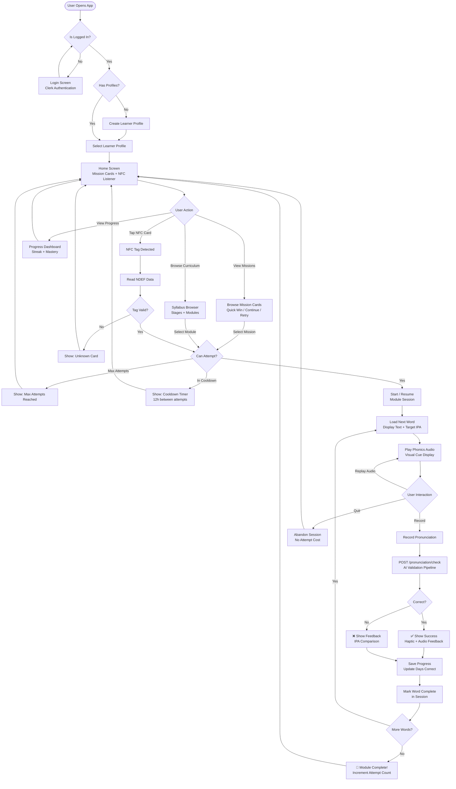

# User Flow Activity Diagram

Complete activity diagram covering the full user journey in the Tutoria mobile app — from authentication through profile selection, NFC scanning, module sessions, pronunciation checking, and progress tracking.

## Flow Summary

1. **Authentication**: User logs in via Clerk. Unauthenticated users are redirected to the login screen.
2. **Profile Selection**: Parent selects (or creates) a learner profile for the session.
3. **Home Screen**: The central hub with mission cards, NFC listener, progress dashboard, and syllabus browser.
4. **Module Entry**: Users can enter a module via NFC card scan, mission card selection, or syllabus browsing.
5. **Eligibility Check**: The API enforces max 3 attempts per module with a 12-hour cooldown between attempts.
6. **Learning Session**: Words are presented one at a time with audio playback. The user records their pronunciation.
7. **Pronunciation Check**: The recording is sent to the AI validation pipeline (`POST /pronunciation/check`) which returns IPA comparison and correctness.
8. **Progress Tracking**: Each word result is saved. When all words are complete, the module attempt is incremented.

