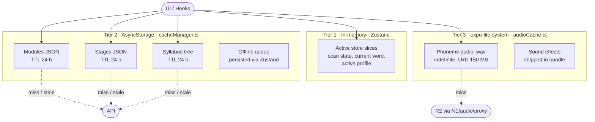
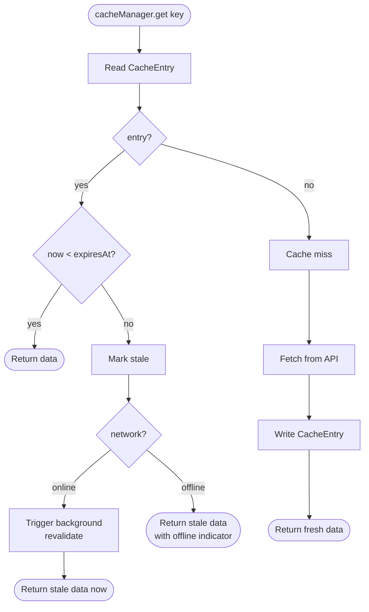

# Caching Strategy

The mobile app maintains three cache tiers backed by distinct storage substrates. Tier
selection is determined by the data type and lifetime: short-lived UI state lives in
memory, curriculum metadata lives in AsyncStorage, and binary audio assets live on the
device file-system.

---

## 1. Three-tier cache topology

---

## 2. Stale-while-revalidate decision

---

## 3. Cache budgets and policies

| Cache | Substrate | Capacity | Eviction | TTL | Invalidation trigger |
|---|---|---|---|---|---|
| Active session | Zustand memory | unbounded* | lifetime of process | session | sign-out, session end |
| Modules / stages | AsyncStorage | ~5 MB (platform soft limit) | manual on schema bump | 24 h | curriculum push notification |
| Audio files | File-system | 150 MB | LRU | none | user "clear cache" action |
| Pronunciation results | not cached | — | — | — | always re-graded |
| Offline queue | AsyncStorage | 200 items / 7 days | FIFO + age drop | per-item 7 d | drain on reconnect |

* Active session is bounded by lesson length (typically 6–12 words). It is not a leak risk.

---

## 4. Cache-key naming convention

| Domain | Key template | Example |
|---|---|---|
| Modules list | `cache:modules:v1` | `cache:modules:v1` |
| Module detail | `cache:module:{id}:v1` | `cache:module:module-a:v1` |
| Stage | `cache:stage:{id}:v1` | `cache:stage:stage-foundations:v1` |
| Syllabus tree | `cache:syllabus:v1` | `cache:syllabus:v1` |
| Audio | `audio:{sha1(r2-path)}` | `audio:9f3a…b21` |

The trailing `:v1` segment is bumped manually whenever the on-the-wire schema for a domain
changes incompatibly, forcing all clients to refresh on the next read.
