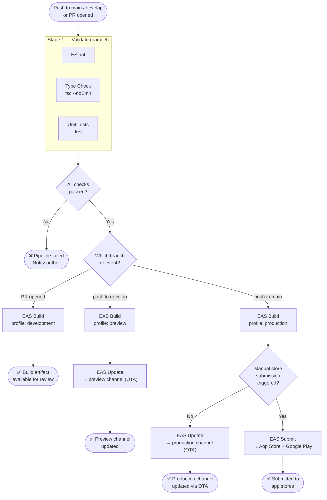
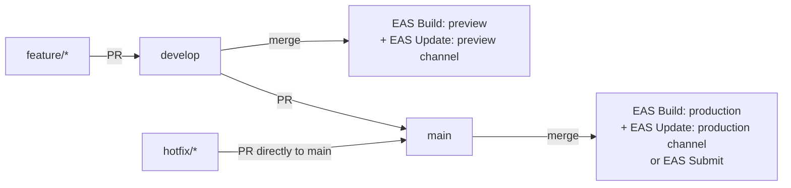

# CI/CD Pipeline — Tutoria Mobile App

This document describes the CI/CD pipeline for the Tutoria mobile app (React Native / Expo SDK 55). It uses GitHub Actions for automation and EAS (Expo Application Services) for builds, OTA updates, and store submissions.

---

## Pipeline Flow

---

## Branch Strategy

---

## Key Notes

- **Full EAS Build required** when native modules or `app.json`/`eas.json` config change — OTA cannot deliver native code.
- **OTA updates** (EAS Update) are limited to JavaScript bundle and asset changes only.
- All sensitive values (tokens, credentials) are stored in **GitHub Actions secrets** and **EAS secrets** — never committed to source.
- **Preview builds** are distributed internally via EAS to testers before anything reaches the public stores.
