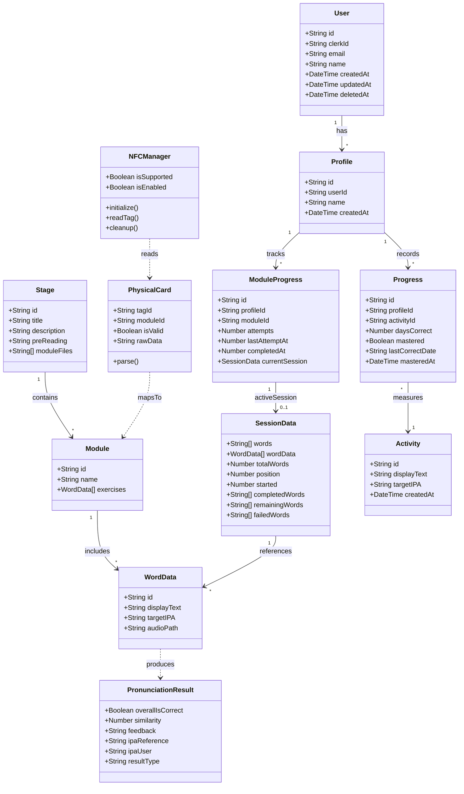

# Domain Class Diagram

Class diagram representing the core domain entities of the Tutoria mobile app and API.

## Key Relationships

- **User → Profile**: One user (parent) can create multiple learner profiles (children).
- **Profile → ModuleProgress**: Each profile independently tracks progress through modules.
- **Profile → Progress**: Each profile tracks per-activity mastery (days correct, mastered flag).
- **Stage → Module → WordData**: The curriculum hierarchy — stages contain modules, modules contain word exercises.
- **ModuleProgress → SessionData**: A module progress record may have one active session at a time (the in-flight learning session).
- **NFCManager → PhysicalCard → Module**: Physical NFC cards are read by the device and mapped to a specific module.
- **WordData → PronunciationResult**: Each word exercise produces a pronunciation check result via the AI pipeline.

## Cardinalities

| Relationship | Cardinality | Notes |
|---|---|---|
| User → Profile | 1 to many | Parent account owns learner profiles |
| Profile → ModuleProgress | 1 to many | One entry per module attempted |
| Profile → Progress | 1 to many | One entry per activity tracked |
| Stage → Module | 1 to many | Curriculum is organized into stages |
| Module → WordData | 1 to many | Each module has multiple word exercises |
| ModuleProgress → SessionData | 1 to 0..1 | At most one active session per module |
| Progress → Activity | Many to 1 | Multiple profiles can track the same activity |

