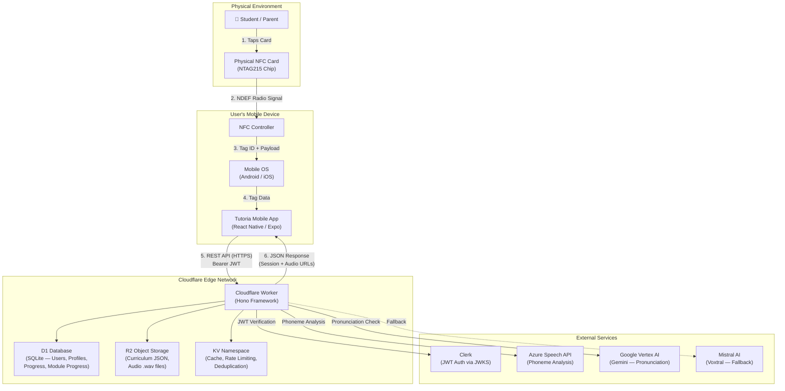

# Deployment Diagram

> **Corrected diagram** — replaces earlier PNGs that incorrectly showed Next.js and PostgreSQL/MongoDB.
> The production infrastructure runs entirely on the **Cloudflare edge** (Worker, D1, R2, KV).

## Deployment Notes

| Component | Technology | Purpose |
|---|---|---|
| **Mobile App** | React Native (Expo) on Android/iOS | Client-side NFC reading, audio playback, multi-sensory UI |
| **API** | Cloudflare Worker with Hono | Edge-deployed REST API — low latency worldwide |
| **Database** | Cloudflare D1 (SQLite) | Users, profiles, progress tracking, module session state |
| **Object Storage** | Cloudflare R2 | Curriculum JSON files and phonics audio (`.wav`) |
| **Cache** | Cloudflare KV | Response caching, rate-limit counters, request deduplication |
| **Auth** | Clerk (JWKS) | JWT issuance and verification for parent accounts |
| **AI** | Azure Speech, Gemini, Mistral | Phoneme extraction, pronunciation validation, fallback analysis |

The entire backend runs on the Cloudflare edge network — there is no traditional server, no Next.js, and no PostgreSQL or MongoDB.
