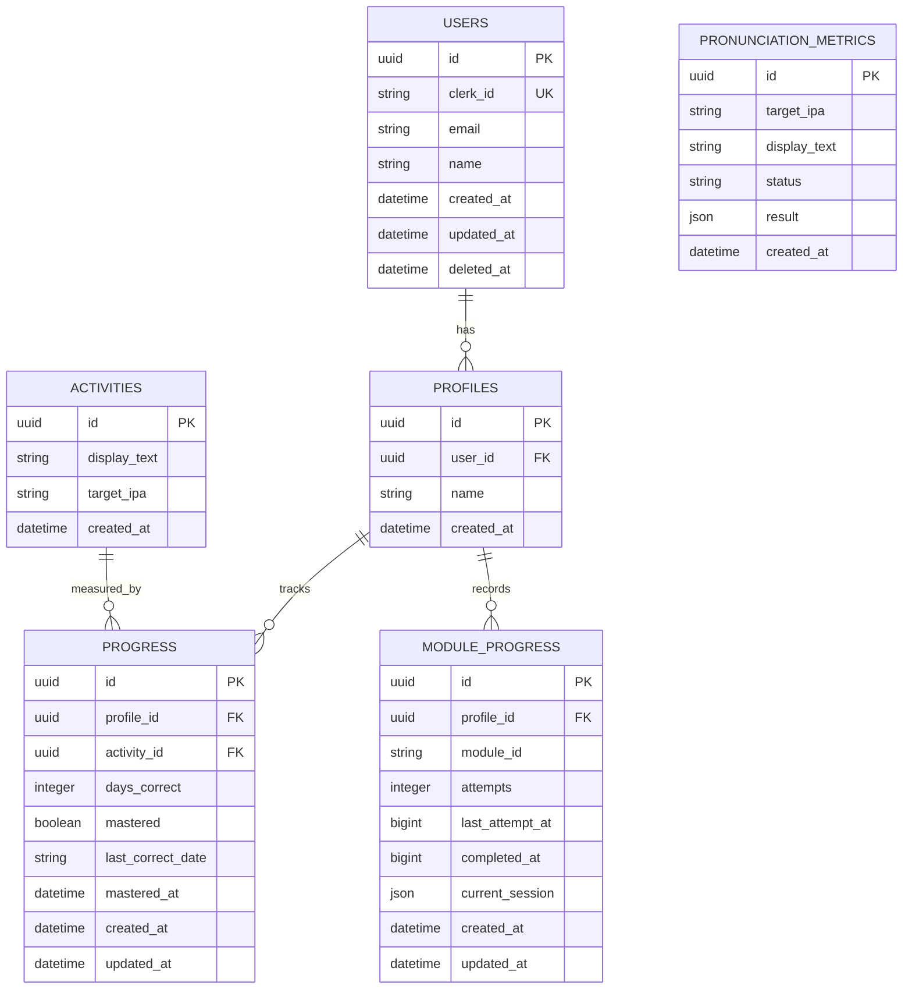

# Entity-Relationship Diagram

ER diagram matching the D1 (SQLite) database schema from the Tutoria API.

## Schema Notes

- **`users`** — Synced from Clerk via webhooks (`user.created`, `user.updated`, `user.deleted` events). The app does not manage user registration directly; Clerk is the source of truth for authentication. The `clerk_id` column is a unique key used to correlate Clerk webhook payloads with local user records.
- **Soft delete on `users`** — When a `user.deleted` webhook fires, the `deleted_at` timestamp is set rather than removing the row. This preserves referential integrity with child profiles and their progress data.
- **`progress.days_correct`** — Increments only once per calendar day. If a learner gets the same activity correct multiple times in one day, the counter increases by at most 1.
- **`progress.mastered`** — Becomes `true` when `days_correct >= 3`. This represents the spaced-repetition threshold: a learner must demonstrate correct pronunciation on 3 separate calendar days to master an activity.
- **`module_progress.current_session`** — A JSON blob containing the full session state (`words`, `wordData`, `totalWords`, `position`, `started`, `completedWords`, `remainingWords`, `failedWords`). This allows sessions to be resumed across app restarts.
- **`module_progress.attempts`** — Maximum of 3 attempts per module. Enforced by the API; the client checks eligibility before starting a session.
- **`module_progress.last_attempt_at`** — Unix timestamp (milliseconds) used to enforce the 12-hour cooldown between attempts. The client compares `Date.now() - last_attempt_at < 12 * 60 * 60 * 1000`.
- **`pronunciation_metrics`** — Fire-and-forget analytics records. These are written by the API during pronunciation checks for monitoring and debugging the AI pipeline. They are not read by the mobile app and have no foreign key relationships.

