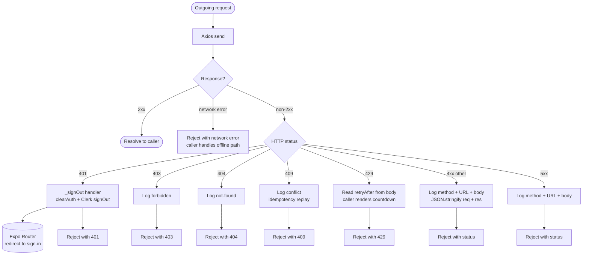

# Error Handling Decision Tree

Failures in Tutoria are classified at the point of first observation and routed to the
narrowest handler that can act on them. The application avoids a single global catch
clause because the appropriate response differs sharply by category — a 401 must clear
the auth store and redirect, while a 429 must surface a cooldown banner without losing
session state.

---

## 1. Axios response interceptor



---

## 2. Failure classification

| Category | Examples | UI surface | Side effects | Caller action |
|---|---|---|---|---|
| Auth failure | 401 | Redirect to sign-in | Auth store cleared | none (handled in interceptor) |
| Rate limit | 429 on `/pronunciation/check` | Countdown banner | Record button disabled until retry-after | start `retryAfter` timer |
| Idempotent replay | 409 with `X-Idempotency-Key` | none | Queue item removed | suppress error |
| Validation | 400 from API | Toast with message | none | re-prompt input |
| Resource missing | 404 on module lookup | Card "lesson unavailable" | Scan reset | offer different module |
| Server failure | 500/502/503 | Offline banner if persistent | None | retry via offline queue |
| Network failure | no response | Offline banner | Enqueue mutation | drain on reconnect |
| Render error | JS throw in component | ErrorBoundary fallback | Subtree remount on retry | logged to console |

---

## 3. Pronunciation-specific error model

```mermaid
flowchart TD
    Resp([PronunciationCheckResponse]) --> ET{errorType field?}
    ET -- audio-too-short --> AS[Banner: "Hold the button longer"]
    ET -- audio-clipped --> AC[Banner: "Move further from mic"]
    ET -- speech-not-detected --> ND[Banner: "We did not hear anything"]
    ET -- service-degraded --> SD[Banner: "Connection issue, try again"]
    ET -- absent --> Check{overallIsCorrect?}

    Check -- true --> Win[Success path]
    Check -- false --> Lose[Failure path]

    AS & AC & ND & SD --> NoCount[Do NOT increment<br/>consecutive-failure counter]
    Lose --> Count[Increment counter]
    Count --> Thresh{counter ≥ 3?}
    Thresh -- yes --> Help[Reveal audio replay<br/>and slow-motion mouth animation]
    Thresh -- no --> Retry[Allow retry]
```

The hard rule, encoded in `usePronunciation`, is that `errorType` must be inspected
*before* `overallIsCorrect`. An infrastructure failure that is treated as a wrong answer
would unfairly damage the learner's streak and trigger the help screen for a fault that
is not their pronunciation.
