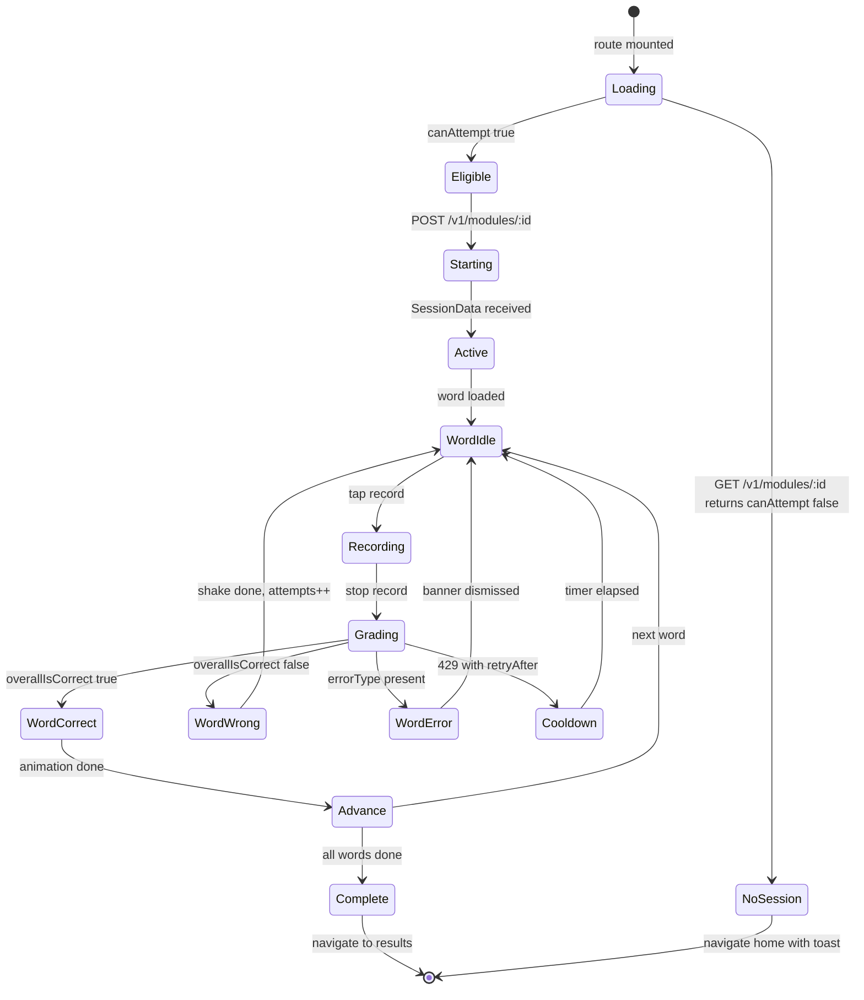
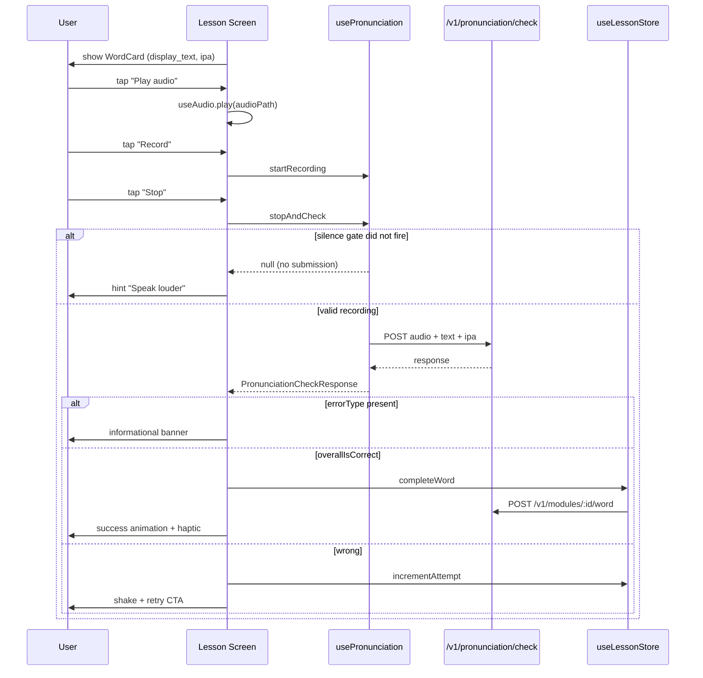

# Lesson Screen State Machine

The lesson screen at `src/app/(public)/lesson/[moduleId].tsx` is the busiest user-facing
component in the application. Its state is the product of three concerns — session
hydration, word-by-word progression, and the pronunciation attempt cycle — that are
encoded as an implicit state machine across `useLessonStore` and component-local state.

---

## 1. High-level lesson lifecycle



---

## 2. Hydration and resume logic

```mermaid
flowchart TD
    Mount([Lesson screen mount]) --> Params[useLocalSearchParams<br/>moduleId]
    Params --> Eligibility[GET /v1/modules/:id]
    Eligibility --> Eligible{canAttempt?}
    Eligible -- false --> Locked[Show "come back later"]
    Eligible -- true --> Start[POST /v1/modules/:id]
    Start --> Hydrate[useLessonStore.hydrateFromSession]

    Hydrate --> Find[Find first word not in<br/>completedWords]
    Find --> Pos{position > 0?}
    Pos -- yes --> Resume[Resume at position]
    Pos -- no --> Edge{any words in<br/>completedWords?}
    Edge -- yes --> Recover[Override position<br/>to first uncompleted index]
    Edge -- no --> Begin[Begin at index 0]

    Resume & Recover & Begin --> Render[Render WordCard]
```

The "edge" branch addresses a known backend race where a previous session crashed after
words were marked complete but before `position` was advanced. Trusting `position` blindly
would replay completed words; trusting `completedWords` alone breaks if the list is empty
on a clean start. The reconciliation logic uses `position` *or* the first uncompleted
index, whichever advances further.

---

## 3. Per-word attempt cycle


