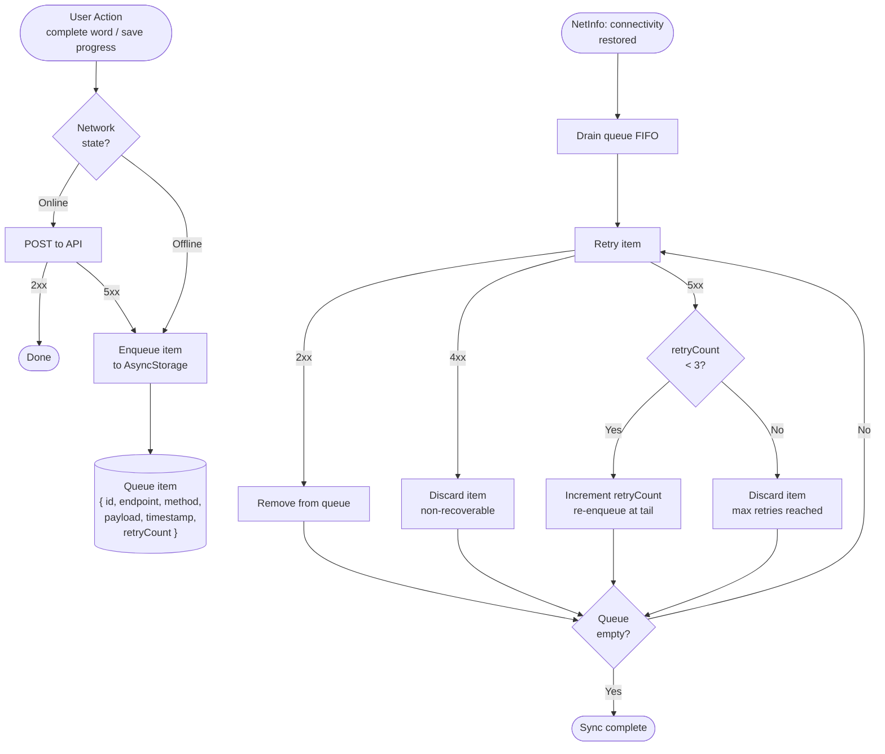
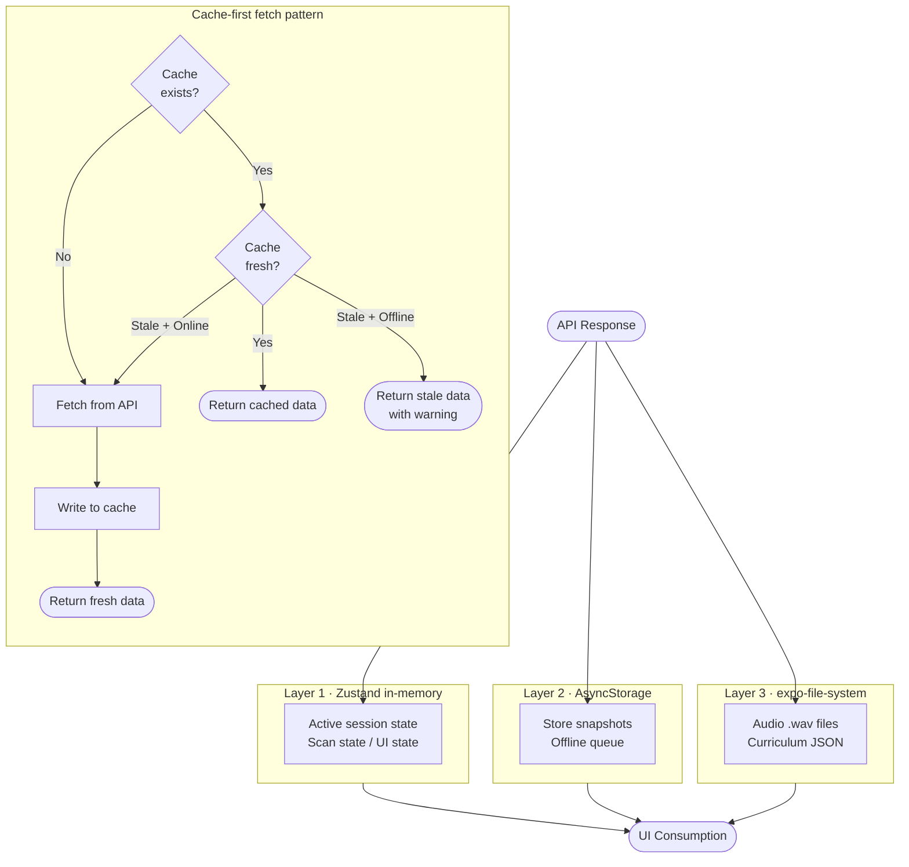
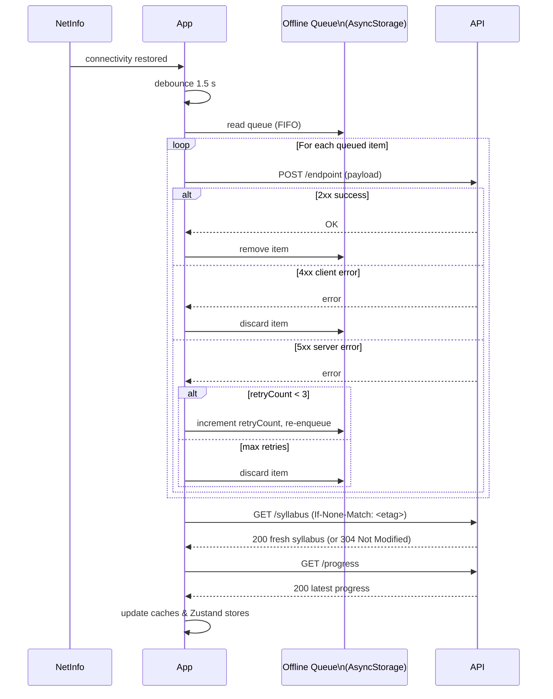

# Offline Sync Architecture

Tutoria queues progress updates locally when the device is offline and drains them sequentially once connectivity is restored. Curriculum and audio assets are cached in layers — in-memory (Zustand), persisted (AsyncStorage), and on-disk (expo-file-system) — with TTL-based invalidation to keep content fresh without unnecessary network calls.

---

## 1. Offline Queue Flow

---

## 2. Caching Layers

---

## 3. Reconnection Sync Flow

---

## Constraints

- **Max queue size:** 200 items — oldest items are discarded when the limit is exceeded.
- **Max item age:** 7 days — items older than this are dropped on startup and during each drain cycle.
- **Audio cache budget:** 150 MB — LRU eviction removes least-recently-played files when the budget is exceeded.
- **Curriculum cache TTL:** 1 hour — revalidated via `ETag` / `If-None-Match`; a `304 Not Modified` response refreshes the TTL without re-downloading the payload.
