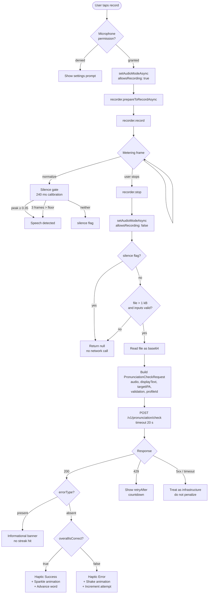
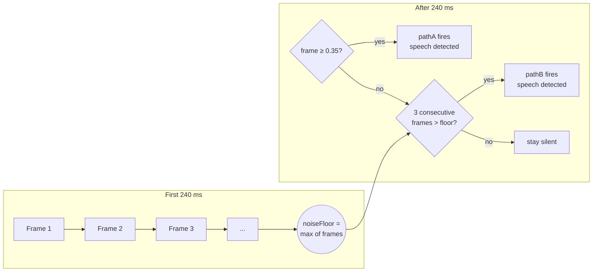

# Pronunciation Pipeline

End-to-end view of the `usePronunciation` hook — from microphone permission acquisition,
through hardware capture and the dual-path silence gate, to backend grading and
multi-sensory feedback.

---

## 1. Recording-to-feedback flow

---

## 2. Silence gate calibration

---

## 3. Backend grading routes

| Client field present | Server route | Components used | Use case |
|---|---|---|---|
| `validation` absent | Force-alignment only | Azure Speech | Standard pronunciation check |
| `validation` present | Two-Sided judge | Azure Speech + Gemini | Word has commonly confused phoneme pair (e.g. /θ/ vs /f/) |
| `unitType: 'sentence'` | Sentence-level scoring | Azure Speech (sentence mode) | Reading fluency checks (Phase 5) |

---

## 4. Latency budget

| Stage | Median (ms) | p95 (ms) | Notes |
|---|---|---|---|
| Microphone warm-up | 80 | 220 | Larger on cold launch |
| Recording (user-controlled) | 1 200 | 2 800 | Excluded from API budget |
| Base64 encode + upload | 350 | 900 | 16 kHz / 16-bit PCM, ~32 kB per word |
| Azure force-alignment | 1 100 | 1 800 | Server-side |
| Gemini Two-Sided judge | 1 400 | 2 600 | Server-side, only when invoked |
| Multi-sensory feedback render | 60 | 120 | Haptic + animation + audio cue |
| **End-to-end (no judge)** | **~1 590 ms** | **~3 040 ms** | Within 20 s server timeout |
| **End-to-end (with judge)** | **~2 990 ms** | **~5 640 ms** | Within 20 s server timeout |
