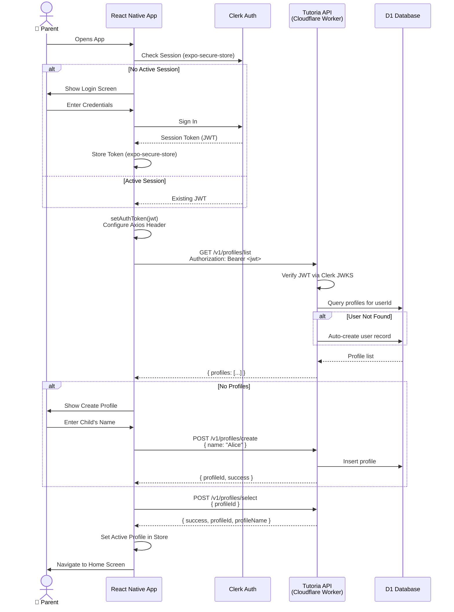

# Authentication Flow Sequence Diagram

> Shows the Clerk-based authentication flow used by the Tutoria mobile app, including automatic user provisioning and profile management.

## Flow Summary

1. **Session Check** — On launch the app checks `expo-secure-store` for an existing Clerk session JWT. If none exists, the parent is prompted to sign in.
2. **Token Configuration** — The JWT is set as the default `Authorization: Bearer` header on the shared Axios instance via `setAuthToken()`.
3. **Profile Loading** — `GET /v1/profiles/list` returns all child profiles for the authenticated parent. The Worker verifies the JWT against Clerk's JWKS endpoint and auto-creates a user record in D1 on first contact.
4. **Profile Creation** — If no profiles exist yet, the parent is guided through creating one (child's name). The API inserts the profile into D1.
5. **Profile Selection** — The parent selects (or the app auto-selects) an active profile via `POST /v1/profiles/select`. The selected `profileId` is stored in the Zustand store and used for all subsequent API calls.
