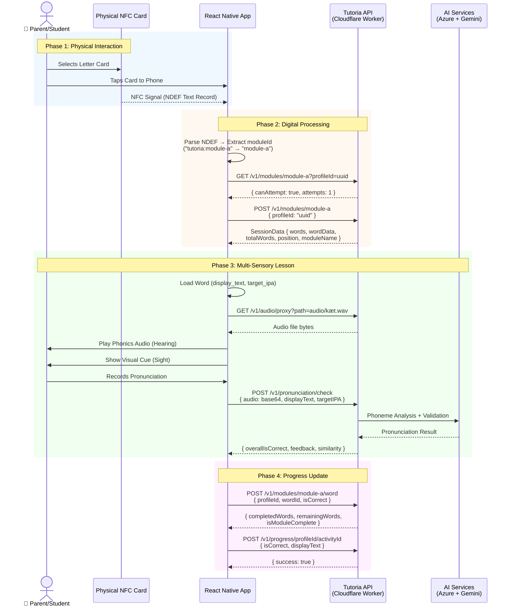

# NFC Lesson Sequence Diagram

> **Corrected diagram** — uses the actual API endpoints (e.g. `/v1/modules/:moduleId`), not the fictional `GET /lesson/content?tag=` shown in earlier PNGs.

## Phase Breakdown

### Phase 1 — Physical Interaction
The student picks up a tangible NFC card (NTAG215) representing a letter or phonics group and taps it against the phone. The card transmits an NDEF text record over the 13.56 MHz radio interface.

### Phase 2 — Digital Processing
The app parses the NDEF payload to extract a `moduleId` (e.g. `"tutoria:module-a"` → `"module-a"`). It first checks eligibility via `GET /v1/modules/:moduleId` and then starts a session with `POST /v1/modules/:moduleId`, receiving the word list and session metadata.

### Phase 3 — Multi-Sensory Lesson
For each word the app fetches the corresponding audio file through `GET /v1/audio/proxy`, plays it for the student, and displays visual cues. When the student records their pronunciation, the audio is sent to `POST /v1/pronunciation/check`, which delegates to Azure Speech for phoneme extraction and Google Gemini for validation.

### Phase 4 — Progress Update
After each word attempt, the app reports results via `POST /v1/modules/:moduleId/word` (module-level tracking) and `POST /v1/progress/:profileId/:activityId` (global progress). The API returns remaining/completed counts so the UI can show progress to the student.
