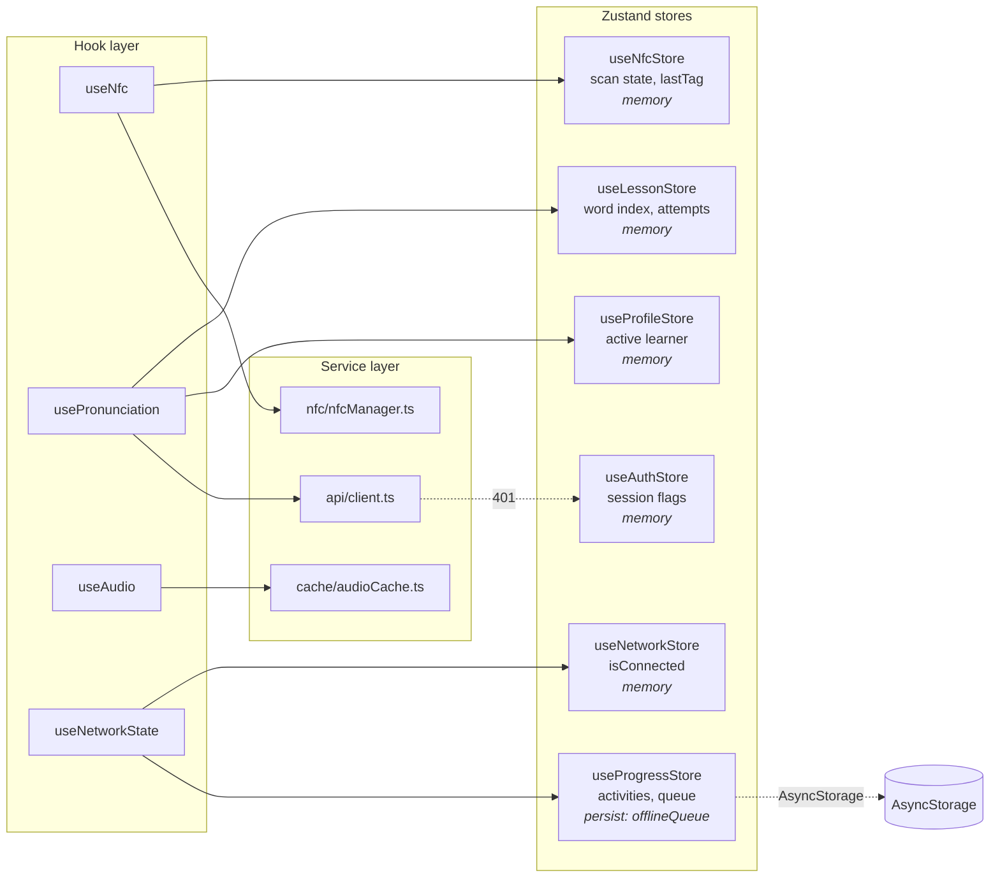

# Zustand Store Topology

Tutoria maintains five global stores under `src/stores/`. Each store owns a narrow
responsibility and is consumed through individual selectors by the hook layer rather than
directly by components. Only `useProgressStore` persists state across launches; the other
four are rehydrated from API responses on application start.

---

## 1. Store responsibilities and persistence

---

## 2. Per-store data ownership

| Store | Owns | Persisted slice | Primary writer | Primary reader |
|---|---|---|---|---|
| `useAuthStore` | `isSignedIn`, `userId`, `token` | none | Clerk session listener | root layout auth guard |
| `useProfileStore` | `activeProfile`, `profiles[]` | none | profile picker screen | `usePronunciation`, progress API calls |
| `useLessonStore` | `currentSession`, word index, attempts, cooldown | none | `hydrateFromSession`, word completion hooks | lesson screen |
| `useNfcStore` | `isSupported`, `isEnabled`, `isScanning`, `lastTag`, `error` | none | `nfcManager` lifecycle, `useNfc` | home screen, scan button |
| `useProgressStore` | `activities[]`, `streak`, `offlineQueue[]`, `isSyncing` | `offlineQueue` only | progress API calls, `addToQueue` | progress tab, `drainQueue` |
| `useNetworkStore` | `isConnected`, `lastChangeAt` | none | `useNetworkState` NetInfo listener | `OfflineBanner`, `useProgressStore.drainQueue` |

---

## 3. Cross-store invariants

- `useAuthStore.isSignedIn === false` ⇒ Expo Router redirect to `(auth)/sign-in`; all
  authenticated stores are reset by `clearAuth`.
- `useNetworkStore.isConnected` transition `false → true` ⇒ `useNetworkState` fires
  `useProgressStore.drainQueue()` after a 1.5 s debounce.
- `useLessonStore.currentSession === null` ⇒ lesson screen renders the resume CTA rather
  than the word card.
