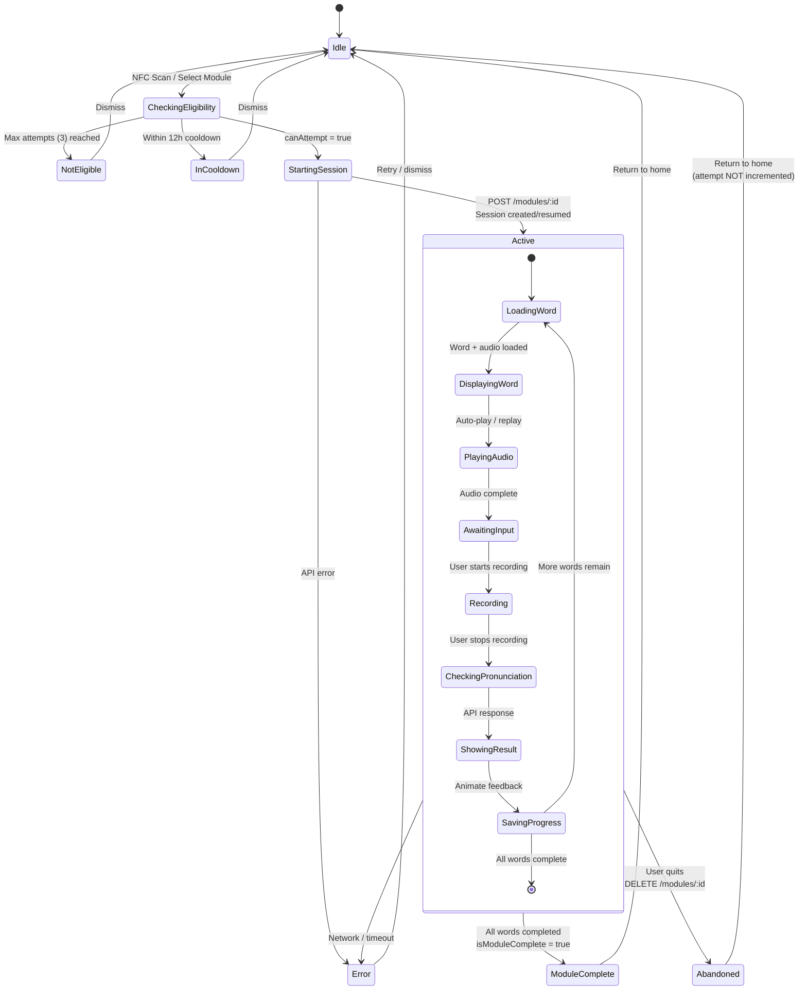

# Module Session State Machine

State machine diagram showing the lifecycle of a module learning session in the Tutoria app.

## Session Rules

- **Max 3 attempts per module**: Once a learner has completed 3 attempts for a module, they cannot start a new session for that module.
- **12-hour cooldown**: After completing an attempt, the learner must wait 12 hours before starting the next attempt. Tracked via `last_attempt_at` timestamp.
- **Abandoning does NOT count as an attempt**: If a user quits mid-session, the attempt counter is not incremented. The session is deleted server-side via `DELETE /modules/:id`.
- **Session data persists server-side**: The `current_session` JSON blob on `ModuleProgress` stores the full session state (position, completed words, remaining words, failed words). This allows sessions to be resumed if the user leaves and returns.
- **Attempt increments on completion only**: The `attempts` counter increases only when all words in the session have been completed (both correct and incorrect results count as completion).

## States

| State | Description |
|---|---|
| **Idle** | No active session. User is on the home screen. |
| **CheckingEligibility** | Validating whether the learner can attempt this module (attempt count + cooldown). |
| **NotEligible** | Max attempts reached. User is blocked from this module. |
| **InCooldown** | Within the 12h cooldown window. Shows remaining time. |
| **StartingSession** | API call in progress to create or resume a session. |
| **Active** | The learning session is in progress (see nested states below). |
| **ModuleComplete** | All words completed. Attempt counter incremented. |
| **Abandoned** | User quit mid-session. Attempt NOT counted. |
| **Error** | Network or API error occurred. |

### Active Sub-States

| Sub-State | Description |
|---|---|
| **LoadingWord** | Fetching the next word and its audio from the session. |
| **DisplayingWord** | Showing the word text and target IPA on screen. |
| **PlayingAudio** | Playing the phonics audio clip for the word. |
| **AwaitingInput** | Waiting for the user to start recording or replay audio. |
| **Recording** | Capturing the user's pronunciation via the microphone. |
| **CheckingPronunciation** | Sending the recording to the API for AI validation. |
| **ShowingResult** | Displaying correctness feedback with IPA comparison. |
| **SavingProgress** | Persisting the result and updating session state. |

