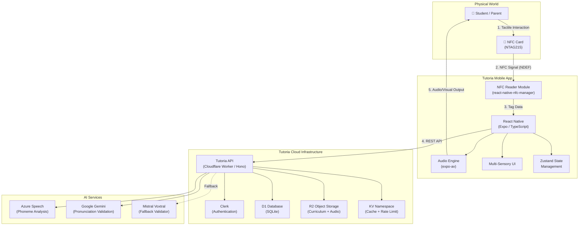

# System Architecture

> **Corrected diagram** — replaces earlier PNGs that incorrectly depicted a Next.js backend with PostgreSQL/MongoDB and REST/GraphQL.
> The actual stack is **Cloudflare Worker (Hono)**, **D1 (SQLite)**, **R2**, **KV**, and **REST only**.

## Data Flow

1. **Tactile Interaction** — The student selects a physical NTAG215 NFC card representing a letter or phonics module.
2. **NFC Signal (NDEF)** — Tapping the card against the phone transmits an NDEF text record containing a `moduleId` (e.g. `tutoria:module-a`).
3. **Tag Data** — `react-native-nfc-manager` parses the NDEF payload and passes the extracted `moduleId` to the React Native application layer.
4. **REST API** — The app calls the Tutoria API (a Cloudflare Worker built with the Hono framework) over HTTPS with a Bearer JWT. The Worker reads from D1 (SQLite) for user/progress data, R2 for curriculum JSON and audio files, and KV for caching and rate-limiting. It also delegates to Clerk for JWT verification and to AI services for pronunciation analysis.
5. **Audio/Visual Output** — The app plays phonics audio via `expo-av` and renders multi-sensory visual cues back to the student, completing the phygital learning loop.
