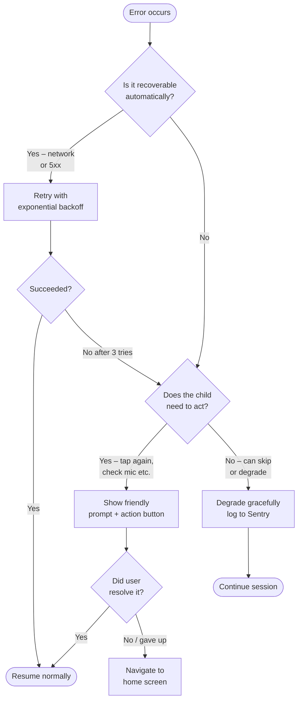
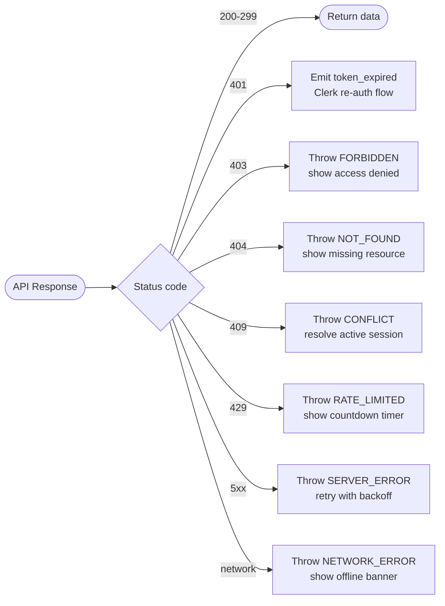
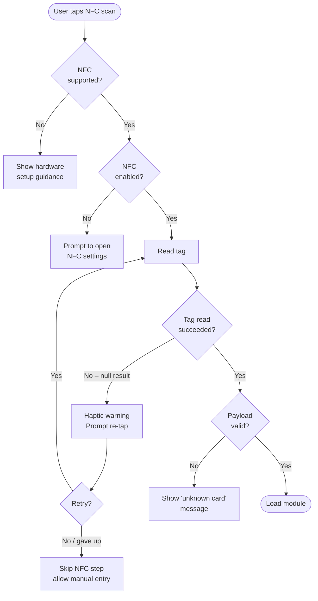
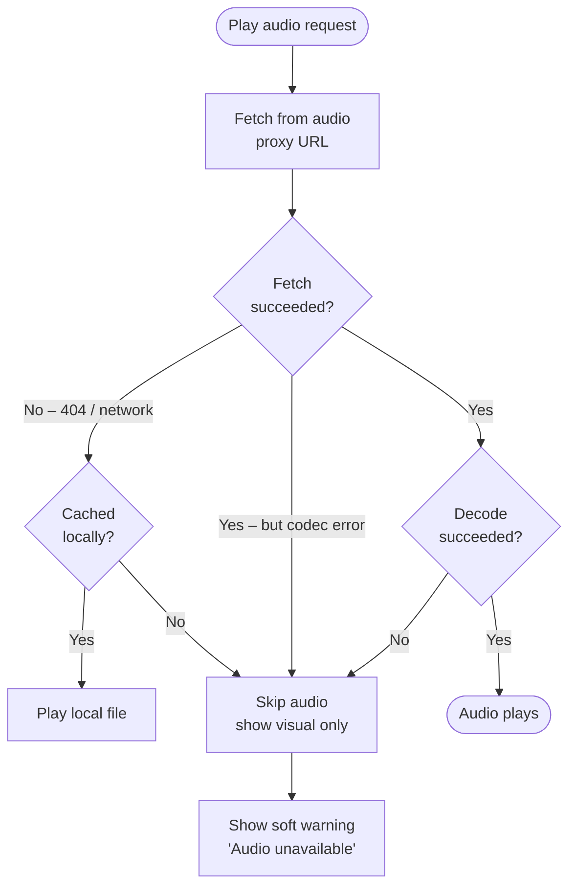
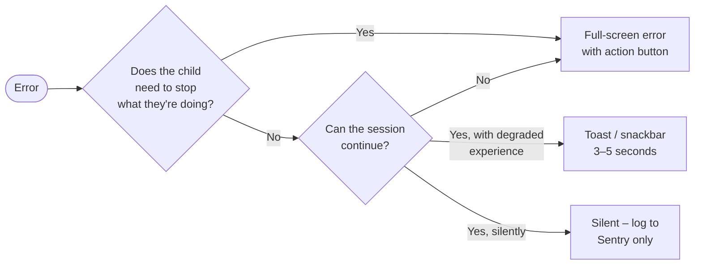

# Error Handling Infrastructure — Tutoria Mobile App

> **Audience:** Engineers contributing to `tutoria-mobile-app`
> **Stack:** React Native 0.83 · Expo 55 · TypeScript · Zustand 5 · Axios 1.13 · Clerk · react-native-nfc-manager · expo-av

---

## Table of Contents

1. [Error Handling Philosophy](#1-error-handling-philosophy)
2. [React Error Boundaries](#2-react-error-boundaries)
3. [API Error Handling (Axios)](#3-api-error-handling-axios)
4. [Retry Strategy](#4-retry-strategy)
5. [NFC Error Handling](#5-nfc-error-handling)
6. [Audio & Pronunciation Error Handling](#6-audio--pronunciation-error-handling)
7. [Crash Reporting (Sentry)](#7-crash-reporting-sentry)
8. [User-Facing Error Messages](#8-user-facing-error-messages)

---

## 1. Error Handling Philosophy

### Four Core Principles

| Principle | What it means in practice |
|-----------|---------------------------|
| **Child-friendly UX** | Every visible error is encouraging, never blaming. No HTTP codes, no stack traces, no developer jargon. |
| **Fail gracefully, never crash** | All unexpected failures are caught at the boundary nearest the error. The app degrades to a safe, recoverable state. |
| **Log everything, show little** | Full error context is captured for developers (Sentry, console in dev). Users see one short, actionable sentence. |
| **Retry automatically where safe; prompt where not** | Network hiccups and 5xx errors retry silently. Destructive or ambiguous situations prompt the child (or parent/tutor). |

### Decision Tree



### Severity Levels

```
FATAL   → unrecoverable, app cannot continue → full-screen error + go home
ERROR   → feature broken, session impacted  → inline error + retry/skip
WARNING → degraded experience               → toast or silent fallback
INFO    → expected edge case                → silent, log only
```

---

## 2. React Error Boundaries

### Why Boundaries Are Needed

React's render cycle will **unmount the entire tree** on an unhandled JS exception. Error boundaries intercept render/lifecycle errors before they propagate up, allowing the UI to show a fallback instead of a blank screen.

> `expo-av`, `react-native-nfc-manager`, and Reanimated worklets can all throw during render. Without boundaries these would silently kill screens.

### Boundary Placement

```
<RootErrorBoundary>          ← catches everything, absolute last resort
  <ClerkProvider>
    <Stack>
      <HomeScreenBoundary>   ← catches home module grid failures
        <HomeScreen />
      </HomeScreenBoundary>

      <LessonScreenBoundary> ← catches lesson / word card failures
        <LessonScreen>
          <NfcScanBoundary>  ← catches NFC component failures
            <NfcScanCard />
          </NfcScanBoundary>
          <AudioPlayerBoundary>
            <AudioPlayer />
          </AudioPlayerBoundary>
        </LessonScreen>
      </LessonScreenBoundary>
    </Stack>
  </ClerkProvider>
</RootErrorBoundary>
```

**Rule of thumb:** wrap every screen and every third-party hardware component (NFC, audio) in its own boundary. Boundaries at the leaf level allow the rest of the screen to keep rendering.

### Global Error Boundary Component

```typescript
// src/components/errors/ErrorBoundary.tsx
import React, { Component, type ReactNode, type ErrorInfo } from 'react';
import { View, Text, StyleSheet, TouchableOpacity } from 'react-native';
import { router } from 'expo-router';
import * as Haptics from 'expo-haptics';
import { captureError } from '../../services/sentry';
import { ERROR_MESSAGES } from '../../utils/errorMessages';

interface Props {
  children: ReactNode;
  /** Render a custom fallback instead of the default recovery UI. */
  fallback?: (reset: () => void) => ReactNode;
  /** Called when the boundary catches an error (useful for parent state reset). */
  onError?: (error: Error, info: ErrorInfo) => void;
  /**
   * Label shown on the primary recovery button.
   * Defaults to "Try Again".
   */
  recoveryLabel?: string;
  /**
   * When true the boundary shows a "Go Home" button instead of a retry.
   * Use for screen-level boundaries where retrying would be meaningless.
   */
  goHomeOnError?: boolean;
}

interface State {
  hasError: boolean;
  error: Error | null;
}

export class ErrorBoundary extends Component<Props, State> {
  state: State = { hasError: false, error: null };

  static getDerivedStateFromError(error: Error): State {
    return { hasError: true, error };
  }

  componentDidCatch(error: Error, info: ErrorInfo): void {
    captureError(error, {
      componentStack: info.componentStack ?? undefined,
      severity: 'fatal',
    });
    this.props.onError?.(error, info);
    // Subtle haptic so the child knows something changed.
    Haptics.notificationAsync(Haptics.NotificationFeedbackType.Warning).catch(() => {});
  }

  private reset = (): void => {
    this.setState({ hasError: false, error: null });
  };

  private goHome = (): void => {
    this.reset();
    router.replace('/');
  };

  render(): ReactNode {
    if (!this.state.hasError) return this.props.children;

    if (this.props.fallback) {
      return this.props.fallback(this.reset);
    }

    return (
      <View style={styles.container}>
        <Text style={styles.emoji}>😟</Text>
        <Text style={styles.title}>Oops!</Text>
        <Text style={styles.message}>{ERROR_MESSAGES.general}</Text>

        {this.props.goHomeOnError ? (
          <TouchableOpacity style={styles.button} onPress={this.goHome} accessibilityRole="button">
            <Text style={styles.buttonText}>Go Home</Text>
          </TouchableOpacity>
        ) : (
          <View style={styles.row}>
            <TouchableOpacity style={styles.button} onPress={this.reset} accessibilityRole="button">
              <Text style={styles.buttonText}>{this.props.recoveryLabel ?? 'Try Again'}</Text>
            </TouchableOpacity>
            <TouchableOpacity style={[styles.button, styles.secondaryButton]} onPress={this.goHome} accessibilityRole="button">
              <Text style={[styles.buttonText, styles.secondaryButtonText]}>Go Home</Text>
            </TouchableOpacity>
          </View>
        )}
      </View>
    );
  }
}

const styles = StyleSheet.create({
  container: {
    flex: 1,
    alignItems: 'center',
    justifyContent: 'center',
    padding: 32,
    backgroundColor: '#FFFBF5',
  },
  emoji: { fontSize: 64, marginBottom: 12 },
  title: { fontSize: 28, fontWeight: '700', color: '#1A1A2E', marginBottom: 8 },
  message: {
    fontSize: 16,
    color: '#555',
    textAlign: 'center',
    lineHeight: 24,
    marginBottom: 32,
  },
  row: { flexDirection: 'row', gap: 12 },
  button: {
    backgroundColor: '#6C63FF',
    paddingHorizontal: 28,
    paddingVertical: 14,
    borderRadius: 100,
  },
  buttonText: { color: '#FFF', fontWeight: '700', fontSize: 16 },
  secondaryButton: { backgroundColor: 'transparent', borderWidth: 2, borderColor: '#6C63FF' },
  secondaryButtonText: { color: '#6C63FF' },
});
```

### Convenience Wrappers

Small typed wrappers keep JSX uncluttered:

```typescript
// src/components/errors/ScreenErrorBoundary.tsx
import { ErrorBoundary } from './ErrorBoundary';
import type { ReactNode } from 'react';

/** Drop around every screen component in the navigator. */
export function ScreenErrorBoundary({ children }: { children: ReactNode }) {
  return (
    <ErrorBoundary goHomeOnError recoveryLabel="Back to Home">
      {children}
    </ErrorBoundary>
  );
}

// src/components/errors/FeatureErrorBoundary.tsx
import { ErrorBoundary } from './ErrorBoundary';
import type { ReactNode } from 'react';

/** Drop around individual features (NFC card, audio player, etc.). */
export function FeatureErrorBoundary({
  children,
  label = 'Retry',
}: {
  children: ReactNode;
  label?: string;
}) {
  return <ErrorBoundary recoveryLabel={label}>{children}</ErrorBoundary>;
}
```

### Usage in Root Layout

```typescript
// src/app/_layout.tsx
import { Slot } from 'expo-router';
import { ErrorBoundary } from '../components/errors/ErrorBoundary';

export default function RootLayout() {
  return (
    <ErrorBoundary goHomeOnError>
      <Slot />
    </ErrorBoundary>
  );
}
```

---

## 3. API Error Handling (Axios)

### Error Response Shape

The backend always returns errors in this envelope:

```typescript
// src/utils/types.ts  (add to existing types)

/** Shape of every non-2xx response body from the Tutoria API. */
export interface ApiErrorBody {
  error: string;
}

/** Normalised error thrown by the Axios interceptor. */
export class ApiError extends Error {
  constructor(
    public readonly status: number,
    public readonly code: ApiErrorCode,
    message: string,
    public readonly retryAfter?: number, // seconds, present on 429
  ) {
    super(message);
    this.name = 'ApiError';
  }
}

export type ApiErrorCode =
  | 'UNAUTHORIZED'
  | 'FORBIDDEN'
  | 'NOT_FOUND'
  | 'CONFLICT'
  | 'RATE_LIMITED'
  | 'SERVER_ERROR'
  | 'NETWORK_ERROR'
  | 'UNKNOWN';
```

### Response Interceptor

Replace the existing minimal interceptor in `src/services/api/client.ts`:

```typescript
// src/services/api/client.ts  — updated interceptor section
import axios, { type AxiosError } from 'axios';
import { API_BASE_URL } from '../../utils/constants';
import { ApiError, type ApiErrorBody } from '../../utils/types';
import { addBreadcrumb } from '../sentry';

const apiClient = axios.create({
  baseURL: API_BASE_URL,
  timeout: 30_000,
  headers: { 'Content-Type': 'application/json' },
});

export function setAuthToken(token: string | null): void {
  if (token) {
    apiClient.defaults.headers.common['Authorization'] = `Bearer ${token}`;
  } else {
    delete apiClient.defaults.headers.common['Authorization'];
  }
}

// ─── Request breadcrumbs ────────────────────────────────────────────────────

apiClient.interceptors.request.use((config) => {
  addBreadcrumb({
    category: 'api.request',
    message: `${config.method?.toUpperCase()} ${config.url}`,
    level: 'info',
  });
  return config;
});

// ─── Response / Error normalisation ────────────────────────────────────────

apiClient.interceptors.response.use(
  (response) => {
    addBreadcrumb({
      category: 'api.response',
      message: `${response.status} ${response.config.url}`,
      level: 'info',
    });
    return response;
  },
  (error: AxiosError<ApiErrorBody>) => {
    // Network / timeout — no response from server
    if (!error.response) {
      addBreadcrumb({ category: 'api.error', message: 'Network error', level: 'warning' });
      return Promise.reject(
        new ApiError(0, 'NETWORK_ERROR', 'No network connection. Please check your internet.'),
      );
    }

    const { status, data, headers } = error.response;
    const message = data?.error ?? 'An unexpected error occurred.';

    addBreadcrumb({
      category: 'api.error',
      message: `${status} ${error.config?.url}`,
      level: status >= 500 ? 'error' : 'warning',
      data: { status, message },
    });

    switch (status) {
      case 401:
        // Trigger the auth re-flow via a custom event; interceptor stays clean.
        authEventEmitter.emit('token_expired');
        return Promise.reject(new ApiError(401, 'UNAUTHORIZED', message));

      case 403:
        return Promise.reject(new ApiError(403, 'FORBIDDEN', message));

      case 404:
        return Promise.reject(new ApiError(404, 'NOT_FOUND', message));

      case 409:
        return Promise.reject(new ApiError(409, 'CONFLICT', message));

      case 429: {
        const retryAfter = parseInt(headers['retry-after'] ?? '60', 10);
        return Promise.reject(new ApiError(429, 'RATE_LIMITED', message, retryAfter));
      }

      default:
        if (status >= 500) {
          return Promise.reject(new ApiError(status, 'SERVER_ERROR', message));
        }
        return Promise.reject(new ApiError(status, 'UNKNOWN', message));
    }
  },
);

export default apiClient;

// ─── Auth event emitter (avoids circular imports with Clerk) ────────────────
import { EventEmitter } from 'eventemitter3';
export const authEventEmitter = new EventEmitter<{ token_expired: [] }>();
```

### Handling Specific Status Codes in Feature Code

```typescript
// Example: src/services/api/modules.ts — startOrResumeModule
import { ApiError } from '../../utils/types';

export async function startOrResumeModule(
  moduleId: string,
  profileId: string,
): Promise<SessionData> {
  try {
    const { data } = await apiClient.post<SessionData>(`/v1/modules/${moduleId}/start`, {
      profileId,
    });
    return data;
  } catch (err) {
    if (err instanceof ApiError && err.code === 'CONFLICT') {
      // 409 — another session is already active; caller resolves the conflict
      throw err;
    }
    throw err; // everything else propagates normally
  }
}
```

### Status Code Handling Strategy



---

## 4. Retry Strategy

### What Is Safe to Retry

| Operation | Retryable? | Reason |
|-----------|-----------|--------|
| `GET` any resource | ✅ Yes | Read-only, always idempotent |
| `POST /v1/modules/:id/start` | ✅ Yes | Backend is idempotent (resumes if already started) |
| `POST /v1/pronunciation/check` | ✅ Yes | Stateless check, no side-effects |
| `POST /v1/progress/save` | ✅ Yes | Backend de-dupes by `activityId` |
| `POST /v1/profiles` (create) | ❌ No | Creates a new resource each call |
| `DELETE` anything | ❌ No | Could delete twice |
| Any `4xx` response | ❌ No | Client error — retrying won't fix it |

### Backoff Formula

```
delay = min(baseDelay × 2^attempt + jitter, maxDelay)

where:
  baseDelay = 1 000 ms
  maxDelay  = 15 000 ms
  jitter    = random(0, 1 000) ms      ← prevents thundering herd
  attempt   ∈ { 0, 1, 2 }             ← 3 total attempts, 2 retries
```

**Resulting delays (approximate):**

| Attempt | Formula | Range |
|---------|---------|-------|
| 0 (first retry) | 1000 × 1 + jitter | 1 000 – 2 000 ms |
| 1 (second retry) | 1000 × 2 + jitter | 2 000 – 3 000 ms |
| 2 (third retry) | 1000 × 4 + jitter | 4 000 – 5 000 ms |

### Retry Utility

```typescript
// src/utils/retry.ts
import { ApiError } from './types';

export interface RetryOptions {
  /** Maximum number of attempts (including the first call). Default: 3. */
  maxAttempts?: number;
  /** Base delay in ms before first retry. Default: 1000. */
  baseDelay?: number;
  /** Maximum delay cap in ms. Default: 15000. */
  maxDelay?: number;
  /** Called before each retry attempt; useful for logging. */
  onRetry?: (attempt: number, error: unknown) => void;
}

/**
 * Execute `fn` and retry on SERVER_ERROR or NETWORK_ERROR with exponential
 * backoff + jitter. All other errors are re-thrown immediately.
 *
 * @example
 * const data = await withRetry(() => apiClient.get('/v1/stages'));
 */
export async function withRetry<T>(
  fn: () => Promise<T>,
  options: RetryOptions = {},
): Promise<T> {
  const { maxAttempts = 3, baseDelay = 1_000, maxDelay = 15_000, onRetry } = options;

  let lastError: unknown;

  for (let attempt = 0; attempt < maxAttempts; attempt++) {
    try {
      return await fn();
    } catch (err) {
      lastError = err;

      const isRetryable =
        err instanceof ApiError &&
        (err.code === 'SERVER_ERROR' || err.code === 'NETWORK_ERROR');

      const isLastAttempt = attempt === maxAttempts - 1;

      if (!isRetryable || isLastAttempt) {
        throw err;
      }

      const jitter = Math.random() * 1_000;
      const delay = Math.min(baseDelay * Math.pow(2, attempt) + jitter, maxDelay);

      onRetry?.(attempt + 1, err);
      await sleep(delay);
    }
  }

  // Should never reach here, but satisfies TypeScript
  throw lastError;
}

function sleep(ms: number): Promise<void> {
  return new Promise((resolve) => setTimeout(resolve, ms));
}
```

### Integrating Retry Into API Calls

```typescript
// src/services/api/syllabus.ts
import { withRetry } from '../../utils/retry';
import apiClient from './client';
import type { Stage } from '../../utils/types';

export async function getStages(): Promise<Stage[]> {
  const { data } = await withRetry(
    () => apiClient.get<Stage[]>('/v1/syllabus/stages'),
    { onRetry: (attempt, err) => console.warn(`[API] Retry ${attempt}:`, err) },
  );
  return data;
}
```

---

## 5. NFC Error Handling

### Error Taxonomy

| Scenario | Root Cause | Recovery Action |
|----------|------------|-----------------|
| `isSupported()` returns `false` | No NFC hardware | Show setup guidance / skip NFC feature |
| `isEnabled()` returns `false` | NFC turned off in settings | Deep-link to device NFC settings |
| Tag read returns `null` | Tag too far, moved during read | Prompt re-tap with haptic feedback |
| `parseNdefPayload` returns `isValid: false` | Wrong NDEF format / non-Tutoria tag | Show "unknown card" message |
| `requestTechnology` throws timeout | iOS 60s scan timeout | Prompt user to restart the scan |
| `requestTechnology` throws on Android background | App backgrounded during scan | Auto-cancel, show re-tap prompt |

### Error Flow



### NFC Error Handler

```typescript
// src/services/nfc/nfcManager.ts  — updated with typed errors
import NfcManager, { NfcTech, Ndef } from 'react-native-nfc-manager';
import * as Haptics from 'expo-haptics';
import { parseNdefPayload } from './tagParser';
import { captureError, addBreadcrumb } from '../sentry';
import type { NfcTagPayload } from '../../utils/types';

export type NfcErrorCode =
  | 'NOT_SUPPORTED'
  | 'NOT_ENABLED'
  | 'READ_FAILED'
  | 'INVALID_PAYLOAD'
  | 'TIMEOUT'
  | 'CANCELLED';

export class NfcError extends Error {
  constructor(
    public readonly code: NfcErrorCode,
    message: string,
  ) {
    super(message);
    this.name = 'NfcError';
  }
}

export async function readTagWithErrorHandling(): Promise<NfcTagPayload> {
  const supported = await NfcManager.isSupported().catch(() => false);
  if (!supported) {
    throw new NfcError('NOT_SUPPORTED', 'NFC hardware not available on this device.');
  }

  const enabled = await NfcManager.isEnabled().catch(() => false);
  if (!enabled) {
    throw new NfcError('NOT_ENABLED', 'NFC is disabled. Please enable it in device settings.');
  }

  addBreadcrumb({ category: 'nfc', message: 'Starting NFC scan', level: 'info' });

  try {
    await NfcManager.requestTechnology(NfcTech.Ndef, {
      // Android only: alert message shown in the system NFC dialog
      alertMessage: 'Hold your Tutoria card near the top of the phone',
    });

    const tag = await NfcManager.getTag();

    if (!tag?.ndefMessage?.length) {
      await Haptics.notificationAsync(Haptics.NotificationFeedbackType.Error);
      throw new NfcError('READ_FAILED', 'Could not read the card. Please try again.');
    }

    const record = tag.ndefMessage[0];
    const rawPayload = Ndef.text.decodePayload(new Uint8Array(record.payload));
    const payload = parseNdefPayload(rawPayload, tag.id ?? '');

    if (!payload.isValid) {
      await Haptics.notificationAsync(Haptics.NotificationFeedbackType.Warning);
      throw new NfcError(
        'INVALID_PAYLOAD',
        `Unrecognised card format: "${payload.rawData}". This is not a Tutoria card.`,
      );
    }

    await Haptics.notificationAsync(Haptics.NotificationFeedbackType.Success);
    addBreadcrumb({
      category: 'nfc',
      message: `Tag scanned: moduleId=${payload.moduleId}`,
      level: 'info',
    });

    return payload;
  } catch (err) {
    // Re-throw our own typed errors
    if (err instanceof NfcError) throw err;

    // Detect iOS 60-second timeout
    const message = err instanceof Error ? err.message : String(err);
    if (message.includes('Timeout') || message.includes('timeout')) {
      throw new NfcError('TIMEOUT', 'The scan timed out. Press the button to try again.');
    }

    // Detect user cancel
    if (message.includes('cancelled') || message.includes('UserCancelledSessionException')) {
      throw new NfcError('CANCELLED', 'Scan was cancelled.');
    }

    captureError(err instanceof Error ? err : new Error(message), {
      tags: { feature: 'nfc' },
      severity: 'error',
    });
    throw new NfcError('READ_FAILED', 'Something went wrong reading the card. Please try again.');
  } finally {
    NfcManager.cancelTechnologyRequest().catch(() => {});
  }
}
```

### Handling NFC Errors in the Hook

```typescript
// src/hooks/useNfc.ts  — updated scan method
import { readTagWithErrorHandling, NfcError, type NfcErrorCode } from '../services/nfc/nfcManager';
import { useNfcStore } from '../stores/useNfcStore';
import { NFC_ERROR_MESSAGES } from '../utils/errorMessages';

export function useNfc() {
  const store = useNfcStore();

  const scan = async () => {
    store.setScanning(true);
    store.setError(null);
    try {
      const tag = await readTagWithErrorHandling();
      store.setLastTag(tag);
      return tag;
    } catch (err) {
      if (err instanceof NfcError) {
        store.setError(NFC_ERROR_MESSAGES[err.code] ?? NFC_ERROR_MESSAGES.READ_FAILED);
      } else {
        store.setError(NFC_ERROR_MESSAGES.READ_FAILED);
      }
      return null;
    } finally {
      store.setScanning(false);
    }
  };

  return { ...store, scan };
}
```

---

## 6. Audio & Pronunciation Error Handling

### Audio Error Flow



### Audio Hook With Error Handling

```typescript
// src/hooks/useAudio.ts  — updated with error handling
import { useCallback, useRef, useState } from 'react';
import { Audio } from 'expo-av';
import { getAudioProxyUrl } from '../services/api/audio';
import { captureError, addBreadcrumb } from '../services/sentry';

export type AudioErrorCode = 'LOAD_FAILED' | 'PLAYBACK_FAILED' | 'CODEC_ERROR' | 'NOT_FOUND';

export interface UseAudioResult {
  play: (r2Path: string) => Promise<boolean>;
  stop: () => Promise<void>;
  isPlaying: boolean;
  error: AudioErrorCode | null;
}

export function useAudio(): UseAudioResult {
  const soundRef = useRef<Audio.Sound | null>(null);
  const [isPlaying, setIsPlaying] = useState(false);
  const [error, setError] = useState<AudioErrorCode | null>(null);

  const play = useCallback(async (r2Path: string): Promise<boolean> => {
    setError(null);
    try {
      if (soundRef.current) {
        await soundRef.current.unloadAsync().catch(() => {});
        soundRef.current = null;
      }

      const url = getAudioProxyUrl(r2Path);
      addBreadcrumb({ category: 'audio', message: `Loading: ${r2Path}`, level: 'info' });

      const { sound, status } = await Audio.Sound.createAsync(
        { uri: url },
        { shouldPlay: false },
      );

      if (!status.isLoaded) {
        throw Object.assign(new Error('Sound failed to load'), { code: 'LOAD_FAILED' });
      }

      soundRef.current = sound;

      sound.setOnPlaybackStatusUpdate((s) => {
        if (s.isLoaded) setIsPlaying(s.isPlaying);
        if (s.isLoaded && s.didJustFinish) setIsPlaying(false);
        if (!s.isLoaded && s.error) {
          setError('PLAYBACK_FAILED');
          setIsPlaying(false);
        }
      });

      await sound.playAsync();
      setIsPlaying(true);
      return true;
    } catch (err) {
      const code: AudioErrorCode =
        (err as { code?: AudioErrorCode }).code ?? 'LOAD_FAILED';

      setError(code);
      setIsPlaying(false);

      captureError(err instanceof Error ? err : new Error(String(err)), {
        tags: { feature: 'audio', path: r2Path },
        severity: 'warning',
      });

      // Graceful degradation — return false so callers can skip audio step
      return false;
    }
  }, []);

  const stop = useCallback(async (): Promise<void> => {
    if (soundRef.current) {
      await soundRef.current.stopAsync().catch(() => {});
      await soundRef.current.unloadAsync().catch(() => {});
      soundRef.current = null;
      setIsPlaying(false);
    }
  }, []);

  return { play, stop, isPlaying, error };
}
```

### Pronunciation Error Handling

```typescript
// src/hooks/usePronunciation.ts  — updated with typed errors and rate-limit timer
import { useCallback, useState } from 'react';
import { Audio } from 'expo-av';
import { checkPronunciation } from '../services/api/pronunciation';
import { ApiError } from '../utils/types';
import { captureError } from '../services/sentry';
import type { PronunciationCheckResponse } from '../utils/types';

export type PronunciationErrorCode =
  | 'PERMISSION_DENIED'
  | 'RECORD_FAILED'
  | 'TIMEOUT'
  | 'RATE_LIMITED'
  | 'CHECK_FAILED';

export interface UsePronunciationResult {
  isRecording: boolean;
  isChecking: boolean;
  result: PronunciationCheckResponse | null;
  error: PronunciationErrorCode | null;
  /** Seconds until rate limit resets. Non-zero when error === 'RATE_LIMITED'. */
  rateLimitCooldown: number;
  startRecording: () => Promise<void>;
  stopAndCheck: (displayText: string, targetIPA: string) => Promise<PronunciationCheckResponse | null>;
  clearError: () => void;
}

export function usePronunciation(): UsePronunciationResult {
  const [isRecording, setIsRecording] = useState(false);
  const [isChecking, setIsChecking] = useState(false);
  const [result, setResult] = useState<PronunciationCheckResponse | null>(null);
  const [error, setError] = useState<PronunciationErrorCode | null>(null);
  const [rateLimitCooldown, setRateLimitCooldown] = useState(0);
  const [recording, setRecording] = useState<Audio.Recording | null>(null);

  const startRecording = useCallback(async () => {
    setError(null);
    setResult(null);

    try {
      const { status } = await Audio.requestPermissionsAsync();
      if (status !== 'granted') {
        setError('PERMISSION_DENIED');
        return;
      }

      await Audio.setAudioModeAsync({ allowsRecordingIOS: true, playsInSilentModeIOS: true });
      const { recording: rec } = await Audio.Recording.createAsync(
        Audio.RecordingOptionsPresets.HIGH_QUALITY,
      );
      setRecording(rec);
      setIsRecording(true);
    } catch (err) {
      setError('RECORD_FAILED');
      captureError(err instanceof Error ? err : new Error(String(err)), {
        tags: { feature: 'pronunciation', step: 'start_recording' },
        severity: 'warning',
      });
    }
  }, []);

  const stopAndCheck = useCallback(
    async (displayText: string, targetIPA: string) => {
      if (!recording) return null;

      setIsRecording(false);
      setIsChecking(true);

      try {
        await recording.stopAndUnloadAsync();
        const uri = recording.getURI();
        setRecording(null);

        if (!uri) throw new Error('No recording URI');

        const response = await fetch(uri);
        const blob = await response.blob();
        const base64 = await blobToBase64(blob);

        const checkResult = await checkPronunciation({
          audio: base64,
          displayText,
          targetIPA,
          audioFormat: 'wav',
        });

        setResult(checkResult);
        return checkResult;
      } catch (err) {
        if (err instanceof ApiError) {
          if (err.code === 'RATE_LIMITED') {
            setError('RATE_LIMITED');
            startCooldownTimer(err.retryAfter ?? 60, setRateLimitCooldown);
          } else {
            setError('CHECK_FAILED');
          }
        } else {
          // Axios timeout
          const msg = err instanceof Error ? err.message : '';
          if (msg.toLowerCase().includes('timeout')) {
            setError('TIMEOUT');
          } else {
            setError('CHECK_FAILED');
          }
          captureError(err instanceof Error ? err : new Error(msg), {
            tags: { feature: 'pronunciation', step: 'check' },
            severity: 'warning',
          });
        }
        return null;
      } finally {
        setIsChecking(false);
      }
    },
    [recording],
  );

  return {
    isRecording,
    isChecking,
    result,
    error,
    rateLimitCooldown,
    startRecording,
    stopAndCheck,
    clearError: () => setError(null),
  };
}

// ─── Helpers ────────────────────────────────────────────────────────────────

function blobToBase64(blob: Blob): Promise<string> {
  return new Promise((resolve, reject) => {
    const reader = new FileReader();
    reader.onloadend = () => {
      const result = reader.result as string;
      resolve(result.split(',')[1]);
    };
    reader.onerror = reject;
    reader.readAsDataURL(blob);
  });
}

function startCooldownTimer(
  seconds: number,
  setCountdown: (n: number) => void,
): void {
  setCountdown(seconds);
  const interval = setInterval(() => {
    setCountdown((prev) => {
      if (prev <= 1) {
        clearInterval(interval);
        return 0;
      }
      return prev - 1;
    });
  }, 1_000);
}
```

### Pronunciation Rate-Limit UI Component

```typescript
// src/components/lesson/PronunciationCooldown.tsx
import { View, Text, StyleSheet } from 'react-native';

interface Props {
  secondsRemaining: number;
}

export function PronunciationCooldown({ secondsRemaining }: Props) {
  return (
    <View style={styles.container}>
      <Text style={styles.emoji}>⏳</Text>
      <Text style={styles.message}>
        Great effort! Let's take a short break — we can try again in{' '}
        <Text style={styles.timer}>{secondsRemaining}s</Text>
      </Text>
    </View>
  );
}

const styles = StyleSheet.create({
  container: { alignItems: 'center', padding: 16 },
  emoji: { fontSize: 40, marginBottom: 8 },
  message: { fontSize: 15, color: '#555', textAlign: 'center', lineHeight: 22 },
  timer: { fontWeight: '700', color: '#6C63FF' },
});
```

---

## 7. Crash Reporting (Sentry)

### Installation

```bash
npx expo install @sentry/react-native
```

Add to `app.json` plugins array:

```json
{
  "expo": {
    "plugins": [
      [
        "@sentry/react-native/expo",
        {
          "url": "https://sentry.io/",
          "project": "tutoria-mobile",
          "organization": "tutoria"
        }
      ]
    ]
  }
}
```

### Sentry Service Module

```typescript
// src/services/sentry.ts
import * as Sentry from '@sentry/react-native';
import Constants from 'expo-constants';

export type ErrorSeverity = 'fatal' | 'error' | 'warning' | 'info';

export interface CaptureOptions {
  tags?: Record<string, string>;
  extra?: Record<string, unknown>;
  componentStack?: string;
  severity?: ErrorSeverity;
}

export interface BreadcrumbData {
  category: string;
  message: string;
  level: 'fatal' | 'error' | 'warning' | 'info' | 'debug';
  data?: Record<string, unknown>;
}

/**
 * Initialise Sentry. Call once from the root layout before any navigation.
 * Safe to call in development — events are suppressed unless DSN is set.
 */
export function initialiseSentry(): void {
  const dsn = process.env.EXPO_PUBLIC_SENTRY_DSN;
  if (!dsn) {
    if (__DEV__) console.warn('[Sentry] EXPO_PUBLIC_SENTRY_DSN not set — crash reporting disabled');
    return;
  }

  Sentry.init({
    dsn,
    environment: process.env.EXPO_PUBLIC_ENV ?? 'development',
    release: `tutoria-mobile@${Constants.expoConfig?.version ?? '0.0.0'}`,
    dist: String(Constants.expoConfig?.ios?.buildNumber ?? Constants.expoConfig?.android?.versionCode ?? 0),

    // ── Performance ──────────────────────────────────────────────────────────
    tracesSampleRate: process.env.EXPO_PUBLIC_ENV === 'production' ? 0.2 : 1.0,
    profilesSampleRate: 0.1,

    // ── Privacy (children's data) ────────────────────────────────────────────
    // Strip PII before any event leaves the device.
    beforeSend(event) {
      return scrubEvent(event);
    },
    beforeSendTransaction(transaction) {
      return scrubTransaction(transaction);
    },

    // ── Integrations ─────────────────────────────────────────────────────────
    integrations: [
      Sentry.mobileReplayIntegration({
        // Mask all text and images — never capture children's faces or names.
        maskAllText: true,
        maskAllImages: true,
      }),
    ],

    // Suppress noisy React Native internal warnings
    ignoreErrors: [
      'Non-Error promise rejection captured',
      'Network request failed',  // handled via ApiError
    ],
  });
}

/** Capture an error with optional context. */
export function captureError(error: Error, options: CaptureOptions = {}): void {
  Sentry.withScope((scope) => {
    if (options.tags) scope.setTags(options.tags);
    if (options.extra) scope.setExtras(options.extra);
    if (options.componentStack) scope.setExtra('componentStack', options.componentStack);
    scope.setLevel(options.severity ?? 'error');
    Sentry.captureException(error);
  });
}

/** Add a breadcrumb to the current Sentry scope. */
export function addBreadcrumb(crumb: BreadcrumbData): void {
  Sentry.addBreadcrumb(crumb);
}

/** Set the active child profile for grouping errors. Uses a stable hash, not the real name. */
export function setProfileContext(profileId: string): void {
  // Only the opaque ID — never the display name.
  Sentry.setUser({ id: profileId });
}

/** Clear user context on sign-out. */
export function clearProfileContext(): void {
  Sentry.setUser(null);
}

// ─── PII scrubbing ──────────────────────────────────────────────────────────

const PII_PATTERNS = [
  /\b[A-Za-z]{2,}\s[A-Za-z]{2,}\b/,  // "First Last" pattern
  /audio:\s*"[^"]{20,}"/,             // base64 audio blobs
  /\b\d{4}[-\s]?\d{4}[-\s]?\d{4}\b/, // card-number-like patterns
];

function scrubEvent(event: Sentry.Event): Sentry.Event | null {
  const json = JSON.stringify(event);
  if (PII_PATTERNS.some((p) => p.test(json))) {
    // Redact the full extra payload; keep the error class and message
    if (event.extra) {
      event.extra = { __redacted__: true };
    }
  }
  // Never send audio data
  if (event.request?.data && typeof event.request.data === 'object') {
    const data = event.request.data as Record<string, unknown>;
    if ('audio' in data) data['audio'] = '[REDACTED]';
  }
  return event;
}

function scrubTransaction(tx: Sentry.TransactionEvent): Sentry.TransactionEvent | null {
  return tx; // Transactions don't carry user data in this app
}
```

### Root Layout With Sentry

```typescript
// src/app/_layout.tsx
import { useEffect } from 'react';
import { Slot, usePathname } from 'expo-router';
import * as Sentry from '@sentry/react-native';
import { ErrorBoundary } from '../components/errors/ErrorBoundary';
import { initialiseSentry, addBreadcrumb } from '../services/sentry';

initialiseSentry();

export default Sentry.wrap(function RootLayout() {
  const pathname = usePathname();

  useEffect(() => {
    addBreadcrumb({ category: 'navigation', message: `Navigated to ${pathname}`, level: 'info' });
  }, [pathname]);

  return (
    <ErrorBoundary goHomeOnError>
      <Slot />
    </ErrorBoundary>
  );
});
```

### Breadcrumb Strategy

Track events at each integration point:

| Event | Category | Example message |
|-------|----------|----------------|
| Screen navigation | `navigation` | `Navigated to /lesson/module-a` |
| API request sent | `api.request` | `POST /v1/pronunciation/check` |
| API response received | `api.response` | `200 /v1/pronunciation/check` |
| API error | `api.error` | `429 /v1/pronunciation/check` |
| NFC scan started | `nfc` | `Starting NFC scan` |
| NFC tag read | `nfc` | `Tag scanned: moduleId=module-a` |
| NFC error | `nfc` | `NFC error: READ_FAILED` |
| Audio playback start | `audio` | `Loading: /sounds/cat.mp3` |
| Pronunciation check | `pronunciation` | `Check started: displayText=cat` |

### Source Maps for Production Builds

Add to your EAS build configuration (`eas.json`):

```json
{
  "build": {
    "production": {
      "env": {
        "SENTRY_AUTH_TOKEN": "<your-auth-token>"
      }
    }
  }
}
```

Sentry will automatically upload source maps during `eas build --profile production` when the Expo plugin is installed.

### Environment Variables Required

```bash
# .env.local (never commit)
EXPO_PUBLIC_SENTRY_DSN=https://<key>@<org>.ingest.sentry.io/<project-id>
EXPO_PUBLIC_ENV=development   # or staging / production
```

---

## 8. User-Facing Error Messages

### Message Design Guidelines

1. **Speak to the child, not the error** — avoid words like "failed", "error", "invalid", "server".
2. **One sentence** — children lose attention quickly.
3. **Always end with what to do next** — "Try again!", "Let's move on.", "Ask your teacher."
4. **Use emoji sparingly** — one per message, at the start, only for emotional reinforcement.
5. **Never show** HTTP status codes, stack traces, request IDs, or technical identifiers.
6. **Blame the app, not the child** — "We couldn't..." not "You couldn't...".

### Message Catalog

```typescript
// src/utils/errorMessages.ts
import type { NfcErrorCode } from '../services/nfc/nfcManager';
import type { PronunciationErrorCode } from '../hooks/usePronunciation';
import type { AudioErrorCode } from '../hooks/useAudio';
import type { ApiErrorCode } from './types';

export const ERROR_MESSAGES = {
  // ── General ───────────────────────────────────────────────────────────────
  general:
    "Something went wrong. Let's go back to the home screen!",
  sessionConflict:
    "Looks like a lesson is already open somewhere. Let's continue from here!",

  // ── Network ───────────────────────────────────────────────────────────────
  network:
    "Oops! We can't connect right now. Check your internet and let's try again!",
  offline:
    "You're offline. We'll save your progress and sync when you're back online.",

  // ── Auth ──────────────────────────────────────────────────────────────────
  authExpired:
    "Your session ran out. Let's sign in again — it only takes a second!",
  authForbidden:
    "Hmm, it looks like you don't have access to that yet. Ask your teacher!",
} as const;

export const NFC_ERROR_MESSAGES: Record<NfcErrorCode, string> = {
  NOT_SUPPORTED:
    "This device doesn't have an NFC reader. Ask your teacher for help!",
  NOT_ENABLED:
    "NFC is switched off. Ask a grown-up to turn it on in the device settings.",
  READ_FAILED:
    "Hmm, I couldn't read that card. Try holding it still for a moment!",
  INVALID_PAYLOAD:
    "That doesn't look like a Tutoria card. Try a different one!",
  TIMEOUT:
    "The scan took too long. Press the button to try again!",
  CANCELLED:
    "Scan cancelled. Press the button whenever you're ready!",
};

export const PRONUNCIATION_ERROR_MESSAGES: Record<PronunciationErrorCode, string> = {
  PERMISSION_DENIED:
    "We need the microphone to hear you. Ask a grown-up to allow it in settings.",
  RECORD_FAILED:
    "We couldn't start recording. Try again in a moment!",
  TIMEOUT:
    "That took a little too long. Let's try saying it again!",
  RATE_LIMITED:
    "Great effort! Let's take a short break and try again soon.",
  CHECK_FAILED:
    "Great try! Let's move on and come back to this one later.",
};

export const AUDIO_ERROR_MESSAGES: Record<AudioErrorCode, string> = {
  LOAD_FAILED:
    "We couldn't load that sound right now. Let's keep going!",
  PLAYBACK_FAILED:
    "The sound stopped unexpectedly. You can tap to replay it.",
  CODEC_ERROR:
    "We couldn't play that audio. Let's skip ahead for now!",
  NOT_FOUND:
    "That sound isn't available right now. Let's move on!",
};

export const API_ERROR_MESSAGES: Record<ApiErrorCode, string> = {
  UNAUTHORIZED: ERROR_MESSAGES.authExpired,
  FORBIDDEN:    ERROR_MESSAGES.authForbidden,
  NOT_FOUND:    "We couldn't find what you were looking for. Let's go back!",
  CONFLICT:     ERROR_MESSAGES.sessionConflict,
  RATE_LIMITED: "We're doing a lot at once! Let's slow down a little.",
  SERVER_ERROR: "Our servers are having a moment. We'll try again automatically!",
  NETWORK_ERROR: ERROR_MESSAGES.network,
  UNKNOWN:      ERROR_MESSAGES.general,
};
```

### Toast vs Full-Screen Error Patterns



**Use a full-screen error for:**
- Unrecoverable app crashes (error boundary caught)
- Auth expired and token refresh failed
- No network AND offline queue full
- NFC `NOT_SUPPORTED` (feature cannot be used at all)

**Use a toast/snackbar for:**
- Audio playback failed (session continues without sound)
- Single API retry succeeded after 1–2 attempts
- Rate limit hit with countdown shown inline
- NFC re-tap prompt (transient, actionable)

**Log silently for:**
- Audio preload failed but playback hasn't been requested yet
- Background sync failed (will retry on next foreground)
- Non-critical analytics API calls

### Toast Component Pattern

```typescript
// src/components/ui/ErrorToast.tsx
import { useEffect } from 'react';
import { Animated, StyleSheet, Text, View } from 'react-native';

interface Props {
  message: string;
  visible: boolean;
  /** Duration in ms before auto-hide. Default: 4000. */
  duration?: number;
  onHide: () => void;
}

export function ErrorToast({ message, visible, duration = 4_000, onHide }: Props) {
  const opacity = new Animated.Value(0);

  useEffect(() => {
    if (!visible) return;
    Animated.sequence([
      Animated.timing(opacity, { toValue: 1, duration: 200, useNativeDriver: true }),
      Animated.delay(duration),
      Animated.timing(opacity, { toValue: 0, duration: 300, useNativeDriver: true }),
    ]).start(() => onHide());
  }, [visible]);

  if (!visible) return null;

  return (
    <Animated.View style={[styles.container, { opacity }]} accessibilityLiveRegion="polite">
      <View style={styles.pill}>
        <Text style={styles.text}>{message}</Text>
      </View>
    </Animated.View>
  );
}

const styles = StyleSheet.create({
  container: {
    position: 'absolute',
    bottom: 40,
    left: 16,
    right: 16,
    alignItems: 'center',
    zIndex: 999,
  },
  pill: {
    backgroundColor: '#1A1A2E',
    borderRadius: 100,
    paddingHorizontal: 24,
    paddingVertical: 12,
    maxWidth: 340,
  },
  text: { color: '#FFF', fontSize: 14, textAlign: 'center', lineHeight: 20 },
});
```

### Degradation Matrix

| Scenario | User sees | Session continues? |
|----------|-----------|-------------------|
| Audio file unavailable | Toast: "We couldn't load that sound right now. Let's keep going!" | ✅ Yes |
| Pronunciation timeout | Inline message + "Try Again" button | ✅ Yes |
| Pronunciation rate limit | Inline cooldown timer | ✅ Yes (skips check) |
| NFC re-tap needed | Prompt + haptic | ✅ Yes (stays on scan screen) |
| NFC not supported | Full info screen | ✅ Yes (manual entry fallback) |
| 409 session conflict | Full prompt: "Continue or start over?" | ✅ Yes (after choice) |
| Network lost mid-session | Offline banner + queue | ✅ Yes (offline mode) |
| Auth token expired | Redirect to sign-in | ❌ No (re-auth required) |
| App crash (error boundary) | Full-screen error + Go Home | ❌ No (full reset) |
| 5xx after 3 retries | Toast + skip action | ⚠️ Partial |

---

## Appendix: File Checklist

When implementing this infrastructure, create or update the following files:

```
src/
├── app/
│   └── _layout.tsx                         ← Add Sentry.wrap + ErrorBoundary
├── components/
│   ├── errors/
│   │   ├── ErrorBoundary.tsx               ← New
│   │   ├── FeatureErrorBoundary.tsx         ← New
│   │   └── ScreenErrorBoundary.tsx          ← New
│   ├── lesson/
│   │   └── PronunciationCooldown.tsx        ← New
│   └── ui/
│       └── ErrorToast.tsx                   ← New
├── hooks/
│   ├── useAudio.ts                          ← Update (typed errors)
│   ├── useNfc.ts                            ← Update (NfcError)
│   └── usePronunciation.ts                  ← Update (typed errors + cooldown)
├── services/
│   ├── api/
│   │   └── client.ts                        ← Update interceptor + ApiError
│   ├── nfc/
│   │   └── nfcManager.ts                    ← Update (NfcError typed throws)
│   └── sentry.ts                            ← New
└── utils/
    ├── errorMessages.ts                     ← New
    ├── retry.ts                             ← New
    └── types.ts                             ← Add ApiError, ApiErrorCode
```

---

*Last updated: see git log — `docs/infrastructure/ERROR_HANDLING.md`*
