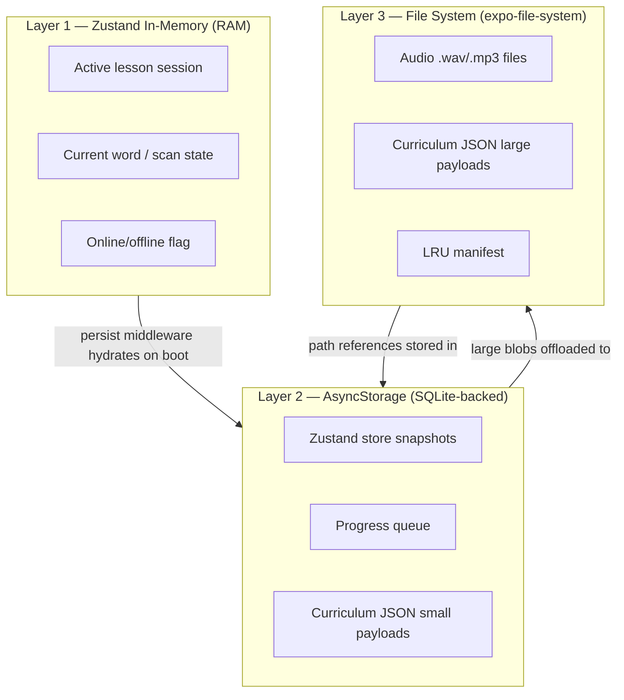
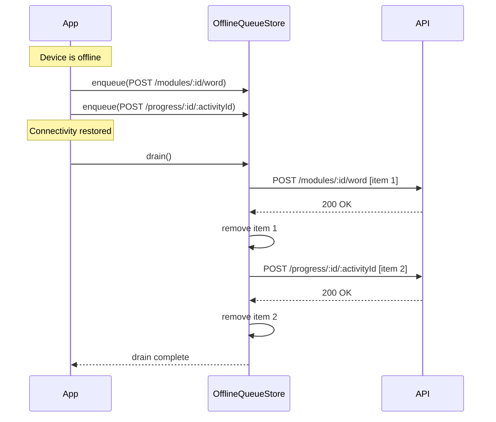
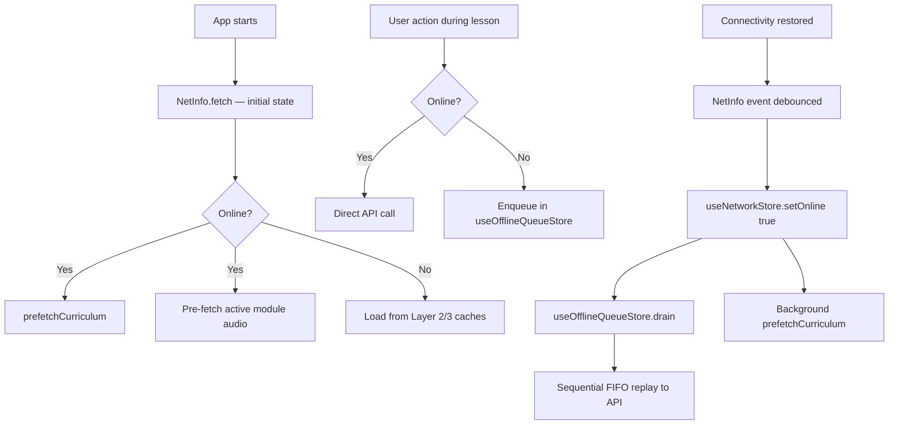

# Offline Strategy

This document describes Tutoria's approach to offline support: what is cached, how writes are queued, how data is invalidated, and the concrete implementation patterns that make each layer work.

---

## Table of Contents

1. [Overview](#1-overview)
2. [Data Caching Layers](#2-data-caching-layers)
3. [Curriculum & Syllabus Caching](#3-curriculum--syllabus-caching)
4. [Audio Asset Pre-fetching](#4-audio-asset-pre-fetching)
5. [Progress Queue (Offline Writes)](#5-progress-queue-offline-writes)
6. [Network State Management](#6-network-state-management)
7. [What Cannot Work Offline](#7-what-cannot-work-offline)
8. [Implementation Patterns](#8-implementation-patterns)

---

## 1. Overview

### Design Philosophy

Tutoria uses **graceful degradation**, not full offline-first. The goal is to keep a learner productive through short connectivity gaps (subway, poor signal, airplane mode) without the complexity of a fully bidirectional sync engine.

| Principle | Detail |
|---|---|
| **Reads degrade silently** | Show cached data, suppress network errors, never block the UI on a fetch. |
| **Writes queue, never drop** | Any state mutation that must reach the server is enqueued and replayed — not silently discarded. |
| **Hard dependencies are honest** | Features that genuinely need the network (pronunciation AI, auth) show a clear, actionable message instead of failing silently. |
| **Storage is budgeted** | Each cache layer has a defined size limit with an eviction policy. The app never grows unbounded on-device storage. |

### What Works Offline vs What Requires Connectivity

```
┌─────────────────────────────────────────────────────────┐
│                    WORKS OFFLINE                        │
├─────────────────────────────────────────────────────────┤
│  • Browse curriculum / syllabus stages  (cached)        │
│  • View previously loaded module details (cached)       │
│  • Play audio for cached words / sounds                 │
│  • Progress through a lesson (word completions queued)  │
│  • View progress dashboard (cached snapshot)            │
│  • NFC tag read and moduleId extraction (100% local)    │
└─────────────────────────────────────────────────────────┘

┌─────────────────────────────────────────────────────────┐
│                 REQUIRES CONNECTIVITY                   │
├─────────────────────────────────────────────────────────┤
│  • Pronunciation checking  (AI pipeline on server)      │
│  • Starting a session for a module not yet cached       │
│  • Clerk token refresh / sign-in                        │
│  • Profile creation or server-side profile selection    │
│  • Draining the progress queue (replaying writes)       │
└─────────────────────────────────────────────────────────┘
```

### Network State Detection

Use [`@react-native-community/netinfo`](https://github.com/react-native-netinfo/react-native-netinfo) as the single source of truth for connectivity:

```ts
import NetInfo, { NetInfoState } from "@react-native-community/netinfo";

// One-time snapshot
const state: NetInfoState = await NetInfo.fetch();
const isOnline = state.isConnected && state.isInternetReachable;

// Continuous listener (use in a Zustand store or React effect)
const unsubscribe = NetInfo.addEventListener((state) => {
  const online = Boolean(state.isConnected && state.isInternetReachable);
  useNetworkStore.getState().setOnline(online);
});
```

> **Note:** `isConnected` alone is not sufficient — a device can be connected to Wi-Fi with no internet access. Always check `isInternetReachable` too.

---

## 2. Data Caching Layers

Three distinct layers manage data persistence, ordered from fastest-to-access to most durable.



### Layer 1 — Zustand In-Memory

**Purpose:** Active runtime state. Fast, zero I/O.

| Store | Offline-relevant fields |
|---|---|
| `useAuthStore` | `isSignedIn`, `token` (auth gate before any cached data is shown) |
| `useLessonStore` | `currentSession`, `currentWord`, `loading` |
| `useNfcStore` | `isScanning`, `lastTag` |
| `useNetworkStore` | `isOnline`, `lastOnlineAt` |
| `useProgressStore` | `activities`, `streakDays` |
| `useOfflineQueueStore` | `queue[]`, `isDraining` |

**Budget:** Unbounded per-session (RAM), cleared on app restart unless persisted.

### Layer 2 — AsyncStorage Persistence

**Purpose:** Survive app restarts. Zustand's `persist` middleware serialises store state to AsyncStorage automatically.

**Persist these stores:**

| Store | Reason |
|---|---|
| `useOfflineQueueStore` | Queued writes must survive a crash or forced-close. |
| `useProgressStore` | Streak / activity snapshot for dashboard while offline. |
| `useProfileStore` | Active profile so the app boots without a network round-trip. |
| `useAuthStore` | Token + sign-in state (encrypted if possible — see §8). |

**Do not persist:**

| Store | Reason |
|---|---|
| `useLessonStore` | Mid-session state is server-owned; stale local state would conflict. |
| `useNfcStore` | Ephemeral scan state, meaningless across restarts. |

**Budget:** Keep each persisted store under **200 KB**. AsyncStorage keys are scoped per store name.

**Cache invalidation:**

- On each app foreground event, compare a stored `_version` field against a known schema version constant. If mismatched, clear and re-hydrate.
- Lesson-derived data (module status) has a **1-hour TTL** stored alongside the payload as `_cachedAt`.

### Layer 3 — File System Cache

**Purpose:** Binary assets and large JSON blobs that are too large for AsyncStorage (which has a ~2 MB practical limit per key on some platforms).

**Directory layout:**

```
<expo-file-system.cacheDirectory>/
  tutoria/
    audio/
      <sha256-of-r2-key>.wav
      <sha256-of-r2-key>.mp3
    curriculum/
      stages-v<etag>.json
    lru-manifest.json       ← LRU eviction index
```

**Budget:**

| Asset type | Limit |
|---|---|
| Audio cache | **150 MB** |
| Curriculum JSON | **5 MB** |
| Total file system cache | **155 MB** |

**Cache invalidation:**

- **Audio files:** LRU eviction when the audio budget is exceeded (see §4).
- **Curriculum JSON:** ETag / version check on reconnect (see §3). Replace the file when the server returns a new ETag.

---

## 3. Curriculum & Syllabus Caching

### Pre-fetch on App Launch

After authentication, before showing the curriculum screen, fetch `GET /v1/syllabus/stages` in the background (non-blocking):

```ts
// src/services/cache/curriculumCache.ts
import * as FileSystem from "expo-file-system";
import apiClient from "@/services/api/client";

const CACHE_DIR = `${FileSystem.cacheDirectory}tutoria/curriculum/`;
const CACHE_KEY = "stages-latest.json";
const CACHE_PATH = `${CACHE_DIR}${CACHE_KEY}`;
const META_PATH = `${CACHE_DIR}stages-meta.json`;
const TTL_MS = 60 * 60 * 1000; // 1 hour

interface CacheMeta {
  etag: string | null;
  cachedAt: number;
}

export async function prefetchCurriculum(): Promise<void> {
  await FileSystem.makeDirectoryAsync(CACHE_DIR, { intermediates: true });
  const meta = await readMeta();
  const headers: Record<string, string> = {};
  if (meta?.etag) {
    headers["If-None-Match"] = meta.etag;
  }

  try {
    const response = await apiClient.get("/v1/syllabus/stages", { headers });
    const etag = response.headers["etag"] ?? null;
    await FileSystem.writeAsStringAsync(CACHE_PATH, JSON.stringify(response.data));
    await writeMeta({ etag, cachedAt: Date.now() });
  } catch (err: any) {
    // 304 Not Modified — cache is still valid, nothing to do
    if (err?.response?.status !== 304) {
      console.warn("[curriculumCache] prefetch failed:", err?.message);
    }
  }
}

export async function getCachedCurriculum(): Promise<unknown | null> {
  try {
    const info = await FileSystem.getInfoAsync(CACHE_PATH);
    if (!info.exists) return null;
    const raw = await FileSystem.readAsStringAsync(CACHE_PATH);
    return JSON.parse(raw);
  } catch {
    return null;
  }
}

async function readMeta(): Promise<CacheMeta | null> {
  try {
    const raw = await FileSystem.readAsStringAsync(META_PATH);
    return JSON.parse(raw);
  } catch {
    return null;
  }
}

async function writeMeta(meta: CacheMeta): Promise<void> {
  await FileSystem.writeAsStringAsync(META_PATH, JSON.stringify(meta));
}
```

### Invalidation on Connectivity Restore

When `isOnline` transitions from `false → true`, trigger a background re-validation:

```ts
// In useNetworkStore or a NetworkMonitor component
useEffect(() => {
  if (isOnline) {
    prefetchCurriculum(); // fire-and-forget; updates the cache silently
  }
}, [isOnline]);
```

### Fallback to Cache When Offline

The `getStages()` API module should use a cache-first pattern:

```ts
// src/services/api/syllabus.ts
import { getCachedCurriculum, prefetchCurriculum } from "@/services/cache/curriculumCache";
import { useNetworkStore } from "@/stores/useNetworkStore";

export async function getStages() {
  const isOnline = useNetworkStore.getState().isOnline;

  if (!isOnline) {
    const cached = await getCachedCurriculum();
    if (cached) return cached;
    throw new Error("Curriculum not available offline. Please connect to load it for the first time.");
  }

  // Online: fetch fresh, cache silently
  await prefetchCurriculum();
  return getCachedCurriculum();
}
```

---

## 4. Audio Asset Pre-fetching

### Download Strategy

Audio files for a module's words are resolved via `GET /v1/audio/sounds-resolve?ipa=<ipa>`, then fetched through `GET /v1/audio/proxy?path=<r2-key>`. Pre-fetch audio for the **active module** immediately after `startOrResumeModule()` resolves, and for the **next queued module** opportunistically when on Wi-Fi.

```ts
// src/services/cache/audioCache.ts
import * as FileSystem from "expo-file-system";
import * as Crypto from "expo-crypto";
import apiClient from "@/services/api/client";

const AUDIO_DIR = `${FileSystem.cacheDirectory}tutoria/audio/`;
const LRU_PATH = `${FileSystem.cacheDirectory}tutoria/lru-manifest.json`;
const MAX_BYTES = 150 * 1024 * 1024; // 150 MB

interface LruEntry {
  filename: string;
  sizeBytes: number;
  lastAccessedAt: number;
}

export async function ensureAudioCached(r2Key: string): Promise<string> {
  await FileSystem.makeDirectoryAsync(AUDIO_DIR, { intermediates: true });

  const filename = await hashKey(r2Key);
  const localPath = `${AUDIO_DIR}${filename}`;
  const info = await FileSystem.getInfoAsync(localPath);

  if (info.exists) {
    await touchLru(filename); // update last-accessed time
    return localPath;
  }

  // Not cached — download from proxy
  const url = `${process.env.EXPO_PUBLIC_API_URL}/v1/audio/proxy?path=${encodeURIComponent(r2Key)}`;
  const downloadResult = await FileSystem.downloadAsync(url, localPath);

  if (downloadResult.status !== 200) {
    // Clean up partial download
    await FileSystem.deleteAsync(localPath, { idempotent: true });
    throw new Error(`Audio download failed: HTTP ${downloadResult.status}`);
  }

  const downloadedInfo = await FileSystem.getInfoAsync(localPath, { size: true });
  const sizeBytes = downloadedInfo.exists && "size" in downloadedInfo ? downloadedInfo.size : 0;
  await addToLru(filename, sizeBytes);
  await evictIfNeeded();

  return localPath;
}

async function hashKey(r2Key: string): Promise<string> {
  return Crypto.digestStringAsync(Crypto.CryptoDigestAlgorithm.SHA256, r2Key);
}

async function readLru(): Promise<LruEntry[]> {
  try {
    const raw = await FileSystem.readAsStringAsync(LRU_PATH);
    return JSON.parse(raw);
  } catch {
    return [];
  }
}

async function writeLru(entries: LruEntry[]): Promise<void> {
  await FileSystem.writeAsStringAsync(LRU_PATH, JSON.stringify(entries));
}

async function touchLru(filename: string): Promise<void> {
  const entries = await readLru();
  const idx = entries.findIndex((e) => e.filename === filename);
  if (idx !== -1) entries[idx].lastAccessedAt = Date.now();
  await writeLru(entries);
}

async function addToLru(filename: string, sizeBytes: number): Promise<void> {
  const entries = await readLru();
  entries.push({ filename, sizeBytes, lastAccessedAt: Date.now() });
  await writeLru(entries);
}

async function evictIfNeeded(): Promise<void> {
  let entries = await readLru();
  let totalBytes = entries.reduce((sum, e) => sum + e.sizeBytes, 0);

  if (totalBytes <= MAX_BYTES) return;

  // Sort ascending by last-accessed time (oldest first)
  entries.sort((a, b) => a.lastAccessedAt - b.lastAccessedAt);

  while (totalBytes > MAX_BYTES && entries.length > 0) {
    const evicted = entries.shift()!;
    await FileSystem.deleteAsync(`${AUDIO_DIR}${evicted.filename}`, { idempotent: true });
    totalBytes -= evicted.sizeBytes;
  }

  await writeLru(entries);
}
```

### Serving Audio

In the lesson screen, resolve audio through the cache layer — never hit the network directly for audio:

```ts
// Usage in lesson screen
import { ensureAudioCached } from "@/services/cache/audioCache";
import { Audio } from "expo-av";

async function playWordAudio(r2Key: string) {
  try {
    const localPath = await ensureAudioCached(r2Key);
    const { sound } = await Audio.Sound.createAsync({ uri: localPath });
    await sound.playAsync();
  } catch (err) {
    console.warn("[audio] falling back to network stream:", err);
    // Fall back to streaming directly from the proxy URL
    const url = `${process.env.EXPO_PUBLIC_API_URL}/v1/audio/proxy?path=${encodeURIComponent(r2Key)}`;
    const { sound } = await Audio.Sound.createAsync({ uri: url });
    await sound.playAsync();
  }
}
```

### Pre-fetch Trigger Points

| Trigger | Action |
|---|---|
| `startOrResumeModule()` resolves | Download all audio for words in the session |
| App enters foreground + online + Wi-Fi | Background pre-fetch next module's audio |
| Cache eviction clears a file | Re-download on next access |

---

## 5. Progress Queue (Offline Writes)

### Queue Item Schema

```ts
// src/stores/useOfflineQueueStore.ts

export type HttpMethod = "POST" | "PUT" | "PATCH" | "DELETE";

export interface QueueItem {
  /** Stable client-generated ID for deduplication */
  id: string;
  endpoint: string;
  method: HttpMethod;
  payload: Record<string, unknown>;
  /** ISO-8601 timestamp of when the item was enqueued */
  timestamp: string;
  retryCount: number;
}

const MAX_QUEUE_SIZE = 200;
const MAX_STALENESS_MS = 7 * 24 * 60 * 60 * 1000; // 7 days
```

### Zustand Store with AsyncStorage Persistence

```ts
// src/stores/useOfflineQueueStore.ts
import { create } from "zustand";
import { persist, createJSONStorage } from "zustand/middleware";
import AsyncStorage from "@react-native-async-storage/async-storage";
import uuid from "react-native-uuid";
import apiClient from "@/services/api/client";

interface OfflineQueueState {
  queue: QueueItem[];
  isDraining: boolean;
  enqueue: (item: Omit<QueueItem, "id" | "timestamp" | "retryCount">) => void;
  drain: () => Promise<void>;
  purgeStale: () => void;
}

export const useOfflineQueueStore = create<OfflineQueueState>()(
  persist(
    (set, get) => ({
      queue: [],
      isDraining: false,

      enqueue(item) {
        set((state) => {
          const newItem: QueueItem = {
            ...item,
            id: uuid.v4() as string,
            timestamp: new Date().toISOString(),
            retryCount: 0,
          };
          // Drop oldest item if queue is at capacity
          const queue =
            state.queue.length >= MAX_QUEUE_SIZE
              ? [...state.queue.slice(1), newItem]
              : [...state.queue, newItem];
          return { queue };
        });
      },

      async drain() {
        if (get().isDraining) return;
        set({ isDraining: true });
        get().purgeStale();

        const queue = [...get().queue]; // snapshot to avoid mutation during iteration
        for (const item of queue) {
          try {
            await apiClient.request({
              method: item.method,
              url: item.endpoint,
              data: item.payload,
            });
            // Remove successfully replayed item
            set((state) => ({
              queue: state.queue.filter((q) => q.id !== item.id),
            }));
          } catch (err: any) {
            const status = err?.response?.status;
            if (status >= 400 && status < 500) {
              // Client error (e.g. 409 conflict, 404 not found) — discard, not retryable
              set((state) => ({
                queue: state.queue.filter((q) => q.id !== item.id),
              }));
            } else {
              // Network error or 5xx — increment retry count and stop draining
              set((state) => ({
                queue: state.queue.map((q) =>
                  q.id === item.id ? { ...q, retryCount: q.retryCount + 1 } : q
                ),
              }));
              break; // stop sequential drain; retry on next reconnect
            }
          }
        }

        set({ isDraining: false });
      },

      purgeStale() {
        const cutoff = Date.now() - MAX_STALENESS_MS;
        set((state) => ({
          queue: state.queue.filter(
            (q) => new Date(q.timestamp).getTime() > cutoff
          ),
        }));
      },
    }),
    {
      name: "tutoria-offline-queue",
      storage: createJSONStorage(() => AsyncStorage),
    }
  )
);
```

### Which Operations Are Queued

| User action | Endpoint queued |
|---|---|
| Word completed during lesson | `POST /v1/modules/:moduleId/word` |
| Progress save after activity | `POST /v1/progress/:profileId/:activityId` |

Operations that are **not queued** (require real-time server response):
- `POST /v1/modules/:moduleId` (start/resume session) — needs the live session object
- `DELETE /v1/modules/:moduleId` (abandon) — fire-and-forget; retry if needed
- `POST /v1/pronunciation/check` — requires AI pipeline, cannot be deferred

### Enqueue Helper (Usage at Call Site)

```ts
// src/services/api/modules.ts (offline-aware version)
import { useNetworkStore } from "@/stores/useNetworkStore";
import { useOfflineQueueStore } from "@/stores/useOfflineQueueStore";
import apiClient from "@/services/api/client";

export async function completeWord(
  moduleId: string,
  profileId: string,
  wordId: string
): Promise<void> {
  const isOnline = useNetworkStore.getState().isOnline;
  const endpoint = `/v1/modules/${moduleId}/word`;
  const payload = { profileId, wordId };

  if (!isOnline) {
    useOfflineQueueStore.getState().enqueue({
      endpoint,
      method: "POST",
      payload,
    });
    return;
  }

  await apiClient.post(endpoint, payload);
}
```

### Conflict Resolution

All queued writes are designed to be **idempotent at the server**:
- Word completions are upserts — submitting a `wordId` already marked complete is a no-op.
- Progress saves use `activityId` as the key — a duplicate save overwrites the same record.

If the server returns a `409 Conflict`, the item is removed from the queue (server state wins). The server's timestamp is authoritative for ordering.

### Queue Lifecycle Diagram



---

## 6. Network State Management

### Zustand Network Store

```ts
// src/stores/useNetworkStore.ts
import { create } from "zustand";

interface NetworkState {
  isOnline: boolean;
  lastOnlineAt: number | null;
  setOnline: (online: boolean) => void;
}

export const useNetworkStore = create<NetworkState>()((set, get) => ({
  isOnline: true, // optimistic default; overwritten by listener immediately
  lastOnlineAt: null,

  setOnline(online) {
    const wasOffline = !get().isOnline;
    set({
      isOnline: online,
      lastOnlineAt: online ? Date.now() : get().lastOnlineAt,
    });

    // Automatically drain the queue when we come back online
    if (online && wasOffline) {
      import("@/stores/useOfflineQueueStore").then(({ useOfflineQueueStore }) => {
        useOfflineQueueStore.getState().drain();
      });
    }
  },
}));
```

### NetInfo Listener Setup

Register the listener once at the application root level (e.g., in `App.tsx` or a `NetworkMonitor` component that mounts at the root):

```ts
// src/components/NetworkMonitor.tsx
import { useEffect } from "react";
import NetInfo from "@react-native-community/netinfo";
import { useNetworkStore } from "@/stores/useNetworkStore";

const DEBOUNCE_MS = 1500; // ignore flaps shorter than 1.5 s

export function NetworkMonitor() {
  useEffect(() => {
    let debounceTimer: ReturnType<typeof setTimeout>;

    const unsubscribe = NetInfo.addEventListener((state) => {
      const online = Boolean(state.isConnected && state.isInternetReachable);
      clearTimeout(debounceTimer);
      debounceTimer = setTimeout(() => {
        useNetworkStore.getState().setOnline(online);
      }, DEBOUNCE_MS);
    });

    // Fetch initial state immediately (no debounce)
    NetInfo.fetch().then((state) => {
      const online = Boolean(state.isConnected && state.isInternetReachable);
      useNetworkStore.getState().setOnline(online);
    });

    return () => {
      unsubscribe();
      clearTimeout(debounceTimer);
    };
  }, []);

  return null; // renderless component
}
```

### UI Indicators

Surface offline state non-intrusively. Avoid modal overlays for transient disconnections:

```ts
// src/components/OfflineBanner.tsx
import { View, Text, StyleSheet } from "react-native";
import { useNetworkStore } from "@/stores/useNetworkStore";

export function OfflineBanner() {
  const isOnline = useNetworkStore((s) => s.isOnline);
  if (isOnline) return null;

  return (
    <View style={styles.banner}>
      <Text style={styles.text}>You're offline — progress will sync when reconnected</Text>
    </View>
  );
}

const styles = StyleSheet.create({
  banner: {
    backgroundColor: "#1a1a1a",
    paddingVertical: 6,
    paddingHorizontal: 16,
    alignItems: "center",
  },
  text: { color: "#facc15", fontSize: 12 },
});
```

Mount `<OfflineBanner />` at the top of the navigation layout so it is visible on every screen without interrupting flow.

### Debounce Rationale

Mobile radio stacks can report rapid `connected → disconnected → connected` transitions (e.g., Wi-Fi hand-off). A 1.5-second debounce prevents:
- Spurious queue drain calls
- Banner flickering
- Unnecessary re-renders

---

## 7. What Cannot Work Offline

### Pronunciation Checking

`POST /v1/pronunciation/check` submits a multipart audio recording to an AI pipeline on the server. There is no way to run this locally.

**User-facing message:**

> "Pronunciation check isn't available offline. Connect to the internet to practice speaking."

Disable the record button and replace it with this message when `isOnline === false`.

### Authentication (Clerk Token Refresh)

Clerk JWTs are short-lived. When the token expires offline, `getToken()` will fail. The app should:
1. Cache the last valid token in `useAuthStore` (AsyncStorage-persisted).
2. Treat read-only, non-auth-required actions as still permitted using the cached profile.
3. Show a banner — not a forced logout — when the token has expired and connectivity is unavailable.

> "Your session will be refreshed automatically when you reconnect."

### Profile Creation / Switching

`POST /v1/profiles/create` and `POST /v1/profiles/select` require server round-trips because the server validates user ownership. These flows must be blocked offline with a message:

> "Profile management requires an internet connection."

### NFC Scan → Lesson Start (Module Not Cached)

If an NFC scan resolves a `moduleId` whose session data is not cached, `POST /v1/modules/:moduleId` cannot be called offline. Show:

> "This lesson hasn't been downloaded yet. Connect to the internet to start it."

If the session **was previously started** and is stored in `useLessonStore`, allow resuming from the cached `currentSession` without a network call.

---

## 8. Implementation Patterns

### Zustand Persist Middleware Configuration

```ts
// src/stores/useProgressStore.ts
import { create } from "zustand";
import { persist, createJSONStorage } from "zustand/middleware";
import AsyncStorage from "@react-native-async-storage/async-storage";

const SCHEMA_VERSION = 1;

interface ProgressState {
  _version: number;
  _cachedAt: number | null;
  activities: number;
  streakDays: number;
  setProgress: (activities: number, streakDays: number) => void;
}

export const useProgressStore = create<ProgressState>()(
  persist(
    (set) => ({
      _version: SCHEMA_VERSION,
      _cachedAt: null,
      activities: 0,
      streakDays: 0,
      setProgress(activities, streakDays) {
        set({ activities, streakDays, _cachedAt: Date.now() });
      },
    }),
    {
      name: "tutoria-progress",
      storage: createJSONStorage(() => AsyncStorage),
      // Only persist the fields we care about
      partialize: (state) => ({
        _version: state._version,
        _cachedAt: state._cachedAt,
        activities: state.activities,
        streakDays: state.streakDays,
      }),
      onRehydrateStorage: () => (state) => {
        if (state && state._version !== SCHEMA_VERSION) {
          // Schema changed — reset to defaults; fresh fetch will populate
          state.activities = 0;
          state.streakDays = 0;
          state._cachedAt = null;
          state._version = SCHEMA_VERSION;
        }
      },
      version: SCHEMA_VERSION,
      migrate: (persistedState, version) => {
        // Add migration logic here for future schema changes
        return persistedState as ProgressState;
      },
    }
  )
);
```

### Network-Aware API Wrapper

Centralise the online/offline routing decision so individual API modules don't need to import `useNetworkStore` directly:

```ts
// src/services/api/networkAware.ts
import { useNetworkStore } from "@/stores/useNetworkStore";
import { useOfflineQueueStore } from "@/stores/useOfflineQueueStore";
import apiClient from "@/services/api/client";
import type { HttpMethod, QueueItem } from "@/stores/useOfflineQueueStore";

interface NetworkAwareOptions {
  /**
   * When true, the call is queued offline and fire-and-forget online.
   * When false (default), the call rejects offline.
   */
  queuable?: boolean;
}

export async function networkAwareRequest<T = unknown>(
  method: HttpMethod,
  endpoint: string,
  payload?: Record<string, unknown>,
  options: NetworkAwareOptions = {}
): Promise<T | null> {
  const isOnline = useNetworkStore.getState().isOnline;

  if (!isOnline) {
    if (options.queuable) {
      useOfflineQueueStore.getState().enqueue({ method, endpoint, payload: payload ?? {} });
      return null;
    }
    throw new Error("OFFLINE");
  }

  const response = await apiClient.request<T>({ method, url: endpoint, data: payload });
  return response.data;
}
```

**Usage:**

```ts
// Queuable write — safe to call offline
await networkAwareRequest("POST", `/v1/modules/${moduleId}/word`, { profileId, wordId }, { queuable: true });

// Read that must fail offline (caller handles "OFFLINE" error)
try {
  const data = await networkAwareRequest("GET", `/v1/syllabus/stages`);
} catch (err: any) {
  if (err.message === "OFFLINE") {
    return getCachedCurriculum();
  }
  throw err;
}
```

### Cache-First Fetch Pattern

A reusable utility for data that can be served from a stale cache while a fresh fetch runs in the background (stale-while-revalidate):

```ts
// src/services/cache/cacheFirst.ts
import * as FileSystem from "expo-file-system";

const CACHE_BASE = `${FileSystem.cacheDirectory}tutoria/`;

interface CacheEntry<T> {
  data: T;
  cachedAt: number;
  etag?: string;
}

export async function cacheFirstFetch<T>(
  cacheKey: string,
  fetcher: (etag?: string) => Promise<{ data: T; etag?: string }>,
  ttlMs: number
): Promise<T> {
  const cachePath = `${CACHE_BASE}${cacheKey}.json`;

  // Try to read from cache
  let cached: CacheEntry<T> | null = null;
  try {
    const info = await FileSystem.getInfoAsync(cachePath);
    if (info.exists) {
      cached = JSON.parse(await FileSystem.readAsStringAsync(cachePath));
    }
  } catch {
    // Cache read failed — treat as cache miss
  }

  const isStale = !cached || Date.now() - cached.cachedAt > ttlMs;

  if (!isStale && cached) {
    // Serve from cache; revalidate in background
    fetcher(cached.etag)
      .then(async ({ data, etag }) => {
        const entry: CacheEntry<T> = { data, cachedAt: Date.now(), etag };
        await FileSystem.makeDirectoryAsync(CACHE_BASE, { intermediates: true });
        await FileSystem.writeAsStringAsync(cachePath, JSON.stringify(entry));
      })
      .catch(() => {/* background revalidation failure is non-fatal */});
    return cached.data;
  }

  // Cache is stale or missing — fetch synchronously
  try {
    const { data, etag } = await fetcher(cached?.etag);
    const entry: CacheEntry<T> = { data, cachedAt: Date.now(), etag };
    await FileSystem.makeDirectoryAsync(CACHE_BASE, { intermediates: true });
    await FileSystem.writeAsStringAsync(cachePath, JSON.stringify(entry));
    return data;
  } catch (err) {
    // Fetch failed — serve stale cache rather than throwing
    if (cached) {
      console.warn("[cacheFirst] Serving stale cache for:", cacheKey);
      return cached.data;
    }
    throw err;
  }
}
```

**Usage:**

```ts
const stages = await cacheFirstFetch(
  "syllabus-stages",
  async (etag) => {
    const headers = etag ? { "If-None-Match": etag } : {};
    const res = await apiClient.get("/v1/syllabus/stages", { headers });
    return { data: res.data, etag: res.headers["etag"] };
  },
  60 * 60 * 1000 // 1-hour TTL
);
```

---

## Summary Reference



| Layer | Technology | Max size | Eviction |
|---|---|---|---|
| In-memory | Zustand | RAM | App restart |
| AsyncStorage | `zustand/middleware persist` | ~200 KB / store | Schema version bump |
| File system — audio | `expo-file-system` | 150 MB | LRU |
| File system — curriculum | `expo-file-system` | 5 MB | ETag revalidation |
| Offline write queue | Zustand + AsyncStorage | 200 items / 7 days | FIFO + staleness purge |
